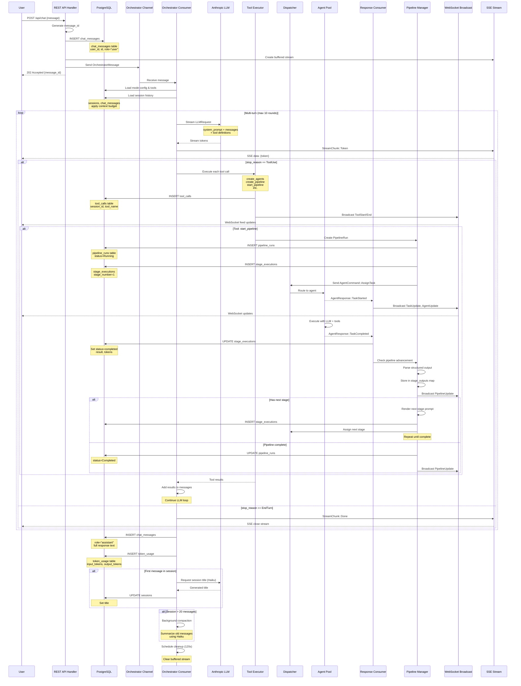

# Chat Message Flow Architecture

> **Complete flow diagram for nexor's chat message processing, including orchestration, pipelines, clusters, and database interactions**

---

## Table of Contents

1. [High-Level Overview](#high-level-overview)
2. [Complete Message Flow](#complete-message-flow)
3. [Component Interactions](#component-interactions)
4. [Pipeline & Cluster Orchestration](#pipeline--cluster-orchestration)
5. [Database Schema & Operations](#database-schema--operations)
6. [WebSocket Broadcasting](#websocket-broadcasting)
7. [Call Order Reference](#call-order-reference)

---

## High-Level Overview

```
┌─────────────────────────────────────────────────────────────────────────────┐
│                              NEXOR ARCHITECTURE                              │
├─────────────────────────────────────────────────────────────────────────────┤
│                                                                              │
│  ┌──────────────┐                                        ┌──────────────┐   │
│  │   Frontend   │◄────── SSE Stream ──────────────────── │  REST API    │   │
│  │  (React UI)  │                                        │   Handlers   │   │
│  │              │◄────── WebSocket Updates ───────┐      │              │   │
│  └──────────────┘                                  │      └──────┬───────┘   │
│                                                     │             │           │
│  ┌──────────────────────────────────────────────┐  │      ┌──────▼───────┐   │
│  │        WebSocket Server                      │  │      │ Orchestrator │   │
│  │  Channels: feed│tasks│agents│sessions│       │  │      │   Consumer   │   │
│  │           pipelines│routing                  │  │      │  (async task)│   │
│  └────────────┬─────────────────────────────────┘  │      └──────┬───────┘   │
│               │                                     │             │           │
│               └─────────────────────────────────────┘             │           │
│                     ▲                                             ▼           │
│                     │                                   ┌──────────────────┐  │
│             ┌───────┴────────┐                          │   LLM Provider   │  │
│             │  Broadcast Hub  │                          │   (Anthropic)   │  │
│             │                 │                          └────────┬─────────┘  │
│             │ • feed_tx       │                                   │           │
│             │ • task_tx       │                                   ▼           │
│             │ • agent_tx      │                          ┌──────────────────┐  │
│             │ • session_tx    │                          │  Tool Execution  │  │
│             │ • pipeline_tx   │                          │    Framework     │  │
│             │ • routing_tx    │                          └────────┬─────────┘  │
│             └───────▲────────┘                                   │           │
│                     │                                            │           │
│      ┌──────────────┴────────────────┐                           │           │
│      │                                │                           │           │
│ ┌────┴─────────┐              ┌──────┴──────────┐      ┌─────────▼────────┐  │
│ │  Response    │              │   Dispatcher    │◄─────│  Agent Pool      │  │
│ │  Consumer    │              │   (Agent Coord) │      │  (Running Agents)│  │
│ │ (async task) │              └──────┬──────────┘      └──────────────────┘  │
│ └────┬─────────┘                     │                                       │
│      │                               │                                       │
│      └───────────┐    ┌──────────────┘                                       │
│                  │    │                                                      │
│            ┌─────▼────▼──────┐                                               │
│            │  Pipeline Mgr   │                                               │
│            │  Cluster Mgr    │                                               │
│            │  Schedule Mgr   │                                               │
│            └────────┬────────┘                                               │
│                     │                                                        │
│                     ▼                                                        │
│            ┌─────────────────┐                                               │
│            │   PostgreSQL    │                                               │
│            │   (gh-agents)   │                                               │
│            └─────────────────┘                                               │
│                                                                              │
└─────────────────────────────────────────────────────────────────────────────┘
```

---

## Complete Message Flow

### Flow Diagram (End-to-End)



---

## Component Interactions

### Startup Sequence

**File:** `src/main.rs` → `src/server/mod.rs`

```
┌──────────────────────────────────────────────────────────────────┐
│ 1. main()                                                        │
│    ├─ Initialize logger (RUST_LOG)                               │
│    ├─ Load config from config.toml                               │
│    ├─ Connect to PostgreSQL (gh-agents DB)                       │
│    └─ Call run_server(config, db_pool)                           │
└──────────────────────────────────────────────────────────────────┘
         ↓
┌──────────────────────────────────────────────────────────────────┐
│ 2. run_server()                                                  │
│    ├─ Create broadcast channels (feed, task, agent, ...)         │
│    ├─ Create MPSC channels (orchestrator, response)              │
│    ├─ Initialize Scheduler                                       │
│    ├─ Initialize Managers (Cluster, Pipeline, Schedule, Role)    │
│    ├─ Build AppState (Arc-wrapped shared state)                  │
│    │   ├─ Load persisted agents from DB                          │
│    │   ├─ Spawn agents into AgentPool                            │
│    │   ├─ Load pipelines into PipelineManager                    │
│    │   └─ Load clusters into ClusterManager                      │
│    └─ Spawn 3 background async tasks                             │
│        ├─ spawn_orchestrator(state.clone(), orchestrator_rx)     │
│        ├─ spawn_response_consumer(state.clone())                 │
│        └─ spawn_schedule_runner(state.clone())                   │
└──────────────────────────────────────────────────────────────────┘
         ↓
┌──────────────────────────────────────────────────────────────────┐
│ 3. Build Router (Axum)                                           │
│    ├─ POST   /api/chat              → send_chat()                │
│    ├─ GET    /api/chat/:id/stream   → stream_response()          │
│    ├─ GET    /api/sessions          → get_sessions()             │
│    ├─ GET    /ws                    → ws_handler()               │
│    ├─ ...    (50+ endpoints)                                     │
│    └─ Layer: CorsLayer, TraceLayer                               │
└──────────────────────────────────────────────────────────────────┘
         ↓
┌──────────────────────────────────────────────────────────────────┐
│ 4. Start HTTP Server                                             │
│    └─ Listen on 0.0.0.0:3000                                     │
└──────────────────────────────────────────────────────────────────┘
```

---

### Orchestrator Multi-Turn Loop

**File:** `src/server/orchestrator.rs:spawn_orchestrator()`

```
┌─────────────────────────────────────────────────────────────────────────┐
│ ORCHESTRATOR CONSUMER (infinite loop)                                   │
├─────────────────────────────────────────────────────────────────────────┤
│                                                                          │
│  while let Some(msg) = orchestrator_rx.recv().await {                   │
│                                                                          │
│    ┌──────────────────────────────────────────────────────────┐         │
│    │ 1. Load Agent Mode                                       │         │
│    │    ├─ Query mode_registry by mode_id                     │         │
│    │    ├─ Extract: system_prompt, tools, history_policy      │         │
│    │    └─ Filter tools (internal-only tools removed)         │         │
│    └──────────────────────────────────────────────────────────┘         │
│              ↓                                                           │
│    ┌──────────────────────────────────────────────────────────┐         │
│    │ 2. Load Chat History                                     │         │
│    │    ├─ If history_policy = SessionScoped:                 │         │
│    │    │   └─ DB: get_session_history(session_id, limit=50)  │         │
│    │    ├─ Else: no history                                   │         │
│    │    ├─ Check context budget (~120K tokens / 480K chars)   │         │
│    │    └─ If exceeded: Haiku summarization (context inject)  │         │
│    └──────────────────────────────────────────────────────────┘         │
│              ↓                                                           │
│    ┌──────────────────────────────────────────────────────────┐         │
│    │ 3. Prepare Messages                                      │         │
│    │    ├─ history_messages: Vec<Message>                     │         │
│    │    └─ current_message: Message {role: user, content}     │         │
│    └──────────────────────────────────────────────────────────┘         │
│              ↓                                                           │
│    ╔══════════════════════════════════════════════════════════╗         │
│    ║ 4. MULTI-TURN LOOP (max 10 rounds)                      ║         │
│    ╠══════════════════════════════════════════════════════════╣         │
│    ║                                                          ║         │
│    ║  for round in 1..=10 {                                  ║         │
│    ║                                                          ║         │
│    ║    ┌──────────────────────────────────────────────┐     ║         │
│    ║    │ A. Create LLMRequest                         │     ║         │
│    ║    │    ├─ system: system_prompt                  │     ║         │
│    ║    │    ├─ messages: accumulated conversation     │     ║         │
│    ║    │    ├─ tools: mode tools                      │     ║         │
│    ║    │    ├─ model: claude-sonnet-4                 │     ║         │
│    ║    │    └─ max_tokens: 8192                       │     ║         │
│    ║    └──────────────────────────────────────────────┘     ║         │
│    ║              ↓                                           ║         │
│    ║    ┌──────────────────────────────────────────────┐     ║         │
│    ║    │ B. Stream from Anthropic                     │     ║         │
│    ║    │    └─ anthropic_client.stream(req).await     │     ║         │
│    ║    └──────────────────────────────────────────────┘     ║         │
│    ║              ↓                                           ║         │
│    ║    ┌──────────────────────────────────────────────┐     ║         │
│    ║    │ C. Process Stream Chunks                     │     ║         │
│    ║    │    while let Some(chunk) = stream.next() {   │     ║         │
│    ║    │      match chunk {                           │     ║         │
│    ║    │        ContentBlockDelta(text) =>            │     ║         │
│    ║    │          ├─ Accumulate text                  │     ║         │
│    ║    │          └─ SSE: StreamChunk::Token(text)    │     ║         │
│    ║    │        ContentBlockDelta(tool_use) =>        │     ║         │
│    ║    │          └─ Build tool call objects          │     ║         │
│    ║    │        MessageDelta(usage) =>                │     ║         │
│    ║    │          └─ Track token counts               │     ║         │
│    ║    │      }                                        │     ║         │
│    ║    │    }                                          │     ║         │
│    ║    └──────────────────────────────────────────────┘     ║         │
│    ║              ↓                                           ║         │
│    ║    ┌──────────────────────────────────────────────┐     ║         │
│    ║    │ D. Handle Stop Reason                        │     ║         │
│    ║    │    match stop_reason {                       │     ║         │
│    ║    │                                              │     ║         │
│    ║    │      StopReason::EndTurn => {                │     ║         │
│    ║    │        └─ SSE: StreamChunk::Done             │     ║         │
│    ║    │        └─ break (exit loop)                  │     ║         │
│    ║    │      }                                        │     ║         │
│    ║    │                                              │     ║         │
│    ║    │      StopReason::ToolUse => {                │     ║         │
│    ║    │        ┌─────────────────────────────┐       │     ║         │
│    ║    │        │ E. Execute Tools            │       │     ║         │
│    ║    │        │   for tool_call in calls {  │       │     ║         │
│    ║    │        │     ├─ Broadcast ToolStart  │       │     ║         │
│    ║    │        │     ├─ execute_tool(...)    │       │     ║         │
│    ║    │        │     │   → See Tools section  │       │     ║         │
│    ║    │        │     ├─ DB: insert_tool_call │       │     ║         │
│    ║    │        │     ├─ Truncate if > 100K   │       │     ║         │
│    ║    │        │     └─ Broadcast ToolEnd    │       │     ║         │
│    ║    │        │   }                         │       │     ║         │
│    ║    │        └─────────────────────────────┘       │     ║         │
│    ║    │        └─ Add tool results to messages       │     ║         │
│    ║    │        └─ continue (next round)              │     ║         │
│    ║    │      }                                        │     ║         │
│    ║    │    }                                          │     ║         │
│    ║    └──────────────────────────────────────────────┘     ║         │
│    ║                                                          ║         │
│    ║  } // end for round                                     ║         │
│    ║                                                          ║         │
│    ╚══════════════════════════════════════════════════════════╝         │
│              ↓                                                           │
│    ┌──────────────────────────────────────────────────────────┐         │
│    │ 5. Post-Processing                                       │         │
│    │    ├─ DB: insert_chat_message(assistant, full_text)      │         │
│    │    ├─ DB: insert_token_usage(session_id, usage)          │         │
│    │    ├─ If first exchange: auto-name session (Haiku)       │         │
│    │    ├─ If >20 messages: background compaction             │         │
│    │    └─ Schedule cleanup after 120s                        │         │
│    └──────────────────────────────────────────────────────────┘         │
│                                                                          │
│  } // end while recv                                                    │
│                                                                          │
└─────────────────────────────────────────────────────────────────────────┘
```

---

## Pipeline & Cluster Orchestration

### Data Structures

**File:** `src/agents/pipeline.rs`

```rust
Pipeline {
    id: PipelineId(Uuid),
    name: String,
    stages: Vec<PipelineStage>
}

PipelineStage {
    stage_number: u32,
    agent_id: Option<AgentId>,         // Direct assignment
    cluster_id: Option<ClusterId>,     // Cluster routing
    role: Option<String>,               // Role name for agent selection
    approval_required: bool,            // Manual gate
    fan_out: bool,                      // Parallel execution
    stage_name: String,                 // Key for output storage
    input_definitions: Value,           // Input schema
    output_description: String,         // Prompt instructions
    output_schema: Value                // Structured extraction schema
}

PipelineRun {
    id: Uuid,
    pipeline_id: PipelineId,
    initial_task: String,
    current_stage: u32,
    stage_task_ids: HashMap<u32, Uuid>,
    stage_outputs: HashMap<String, Value>,  // Keyed by stage_name
    status: Running | WaitingForApproval | Completed | Failed,
    total_tokens: (u32, u32)
}
```

**File:** `src/agents/cluster.rs`

```rust
Cluster {
    id: ClusterId(Uuid),
    name: String,
    description: String,
    members: Vec<AgentId>,
    shared_context: ClusterContext {
        conventions: String,
        shared_files: Vec<FileContent>
    }
}
```

---

### Pipeline Auto-Advancement Flow

**File:** `src/server/orchestrator.rs:spawn_response_consumer()`

```
┌─────────────────────────────────────────────────────────────────────────┐
│ RESPONSE CONSUMER (infinite loop)                                       │
├─────────────────────────────────────────────────────────────────────────┤
│                                                                          │
│  while let Some(response) = response_rx.recv().await {                  │
│                                                                          │
│    match response {                                                     │
│                                                                          │
│      ┌────────────────────────────────────────────────────────┐         │
│      │ AgentResponse::TaskCompleted {                        │         │
│      │   task_id, agent_id, result                           │         │
│      │ }                                                      │         │
│      └────────────────────────────────────────────────────────┘         │
│              ↓                                                           │
│      ┌────────────────────────────────────────────────────────┐         │
│      │ 1. Broadcast Updates                                  │         │
│      │    ├─ task_tx.send(TaskUpdate::Completed)             │         │
│      │    └─ agent_tx.send(AgentUpdate::Idle)                │         │
│      └────────────────────────────────────────────────────────┘         │
│              ↓                                                           │
│      ┌────────────────────────────────────────────────────────┐         │
│      │ 2. Check if task is part of pipeline                 │         │
│      │    ├─ pipeline_mgr.find_run_by_task(task_id)          │         │
│      │    └─ If found → proceed to advancement               │         │
│      └────────────────────────────────────────────────────────┘         │
│              ↓                                                           │
│      ╔════════════════════════════════════════════════════════╗         │
│      ║ 3. PIPELINE ADVANCEMENT LOGIC                         ║         │
│      ╠════════════════════════════════════════════════════════╣         │
│      ║                                                        ║         │
│      ║  ┌──────────────────────────────────────────────┐     ║         │
│      ║  │ A. Persist Stage Completion                  │     ║         │
│      ║  │    ├─ DB: UPDATE stage_executions            │     ║         │
│      ║  │    │   SET status = 'completed'               │     ║         │
│      ║  │    │       result = ?                         │     ║         │
│      ║  │    │       completed_at = NOW()               │     ║         │
│      ║  │    │       tokens_in = ?, tokens_out = ?      │     ║         │
│      ║  │    │   WHERE run_id = ? AND stage_number = ?  │     ║         │
│      ║  │    │                                          │     ║         │
│      ║  │    └─ DB: UPDATE pipeline_runs               │     ║         │
│      ║  │        SET total_tokens_in += ?              │     ║         │
│      ║  │            total_tokens_out += ?             │     ║         │
│      ║  └──────────────────────────────────────────────┘     ║         │
│      ║            ↓                                           ║         │
│      ║  ┌──────────────────────────────────────────────┐     ║         │
│      ║  │ B. Parse Structured Output                   │     ║         │
│      ║  │    ├─ Extract output_schema from stage       │     ║         │
│      ║  │    ├─ Parse result text as JSON              │     ║         │
│      ║  │    └─ Store in run.stage_outputs[stage_name] │     ║         │
│      ║  └──────────────────────────────────────────────┘     ║         │
│      ║            ↓                                           ║         │
│      ║  ┌──────────────────────────────────────────────┐     ║         │
│      ║  │ C. Broadcast Pipeline Update                 │     ║         │
│      ║  │    └─ pipeline_tx.send(                      │     ║         │
│      ║  │         PipelineUpdate::StageCompleted {     │     ║         │
│      ║  │           run_id, stage_number, output       │     ║         │
│      ║  │         }                                     │     ║         │
│      ║  │       )                                       │     ║         │
│      ║  └──────────────────────────────────────────────┘     ║         │
│      ║            ↓                                           ║         │
│      ║  ┌──────────────────────────────────────────────┐     ║         │
│      ║  │ D. Determine Next Action                     │     ║         │
│      ║  │    match next_stage {                        │     ║         │
│      ║  │                                              │     ║         │
│      ║  │      Some(stage) => {                        │     ║         │
│      ║  │        if stage.approval_required {          │     ║         │
│      ║  │          ├─ Set run.status = WaitingForApproval   ║         │
│      ║  │          ├─ DB: UPDATE pipeline_runs         │     ║         │
│      ║  │          └─ Broadcast ApprovalRequest        │     ║         │
│      ║  │        } else {                              │     ║         │
│      ║  │          └─ Auto-advance to next stage       │     ║         │
│      ║  │             (see section E below)            │     ║         │
│      ║  │        }                                      │     ║         │
│      ║  │      }                                        │     ║         │
│      ║  │                                              │     ║         │
│      ║  │      None => {                               │     ║         │
│      ║  │        ├─ Pipeline complete!                 │     ║         │
│      ║  │        ├─ DB: UPDATE pipeline_runs           │     ║         │
│      ║  │        │   SET status = 'completed'           │     ║         │
│      ║  │        │       completed_at = NOW()           │     ║         │
│      ║  │        └─ Broadcast PipelineCompleted        │     ║         │
│      ║  │      }                                        │     ║         │
│      ║  │    }                                          │     ║         │
│      ║  └──────────────────────────────────────────────┘     ║         │
│      ║            ↓                                           ║         │
│      ║  ┌──────────────────────────────────────────────┐     ║         │
│      ║  │ E. Auto-Advance to Next Stage                │     ║         │
│      ║  │                                              │     ║         │
│      ║  │  ┌────────────────────────────────────┐      │     ║         │
│      ║  │  │ 1. Render Stage Prompt             │      │     ║         │
│      ║  │  │    ├─ Load output_description      │      │     ║         │
│      ║  │  │    ├─ Inject previous outputs:     │      │     ║         │
│      ║  │  │    │   {{stage_1.output}}          │      │     ║         │
│      ║  │  │    │   {{stage_2.output}}          │      │     ║         │
│      ║  │  │    └─ Produce final task prompt    │      │     ║         │
│      ║  │  └────────────────────────────────────┘      │     ║         │
│      ║  │            ↓                                  │     ║         │
│      ║  │  ┌────────────────────────────────────┐      │     ║         │
│      ║  │  │ 2. Resolve Agent                   │      │     ║         │
│      ║  │  │    if stage.agent_id.is_some() {   │      │     ║         │
│      ║  │  │      └─ Use specified agent        │      │     ║         │
│      ║  │  │    } else if stage.cluster_id {    │      │     ║         │
│      ║  │  │      ├─ Load cluster members       │      │     ║         │
│      ║  │  │      └─ Pick available agent       │      │     ║         │
│      ║  │  │    } else if stage.role {          │      │     ║         │
│      ║  │  │      └─ role_mgr.get_agent(role)   │      │     ║         │
│      ║  │  │    }                                │      │     ║         │
│      ║  │  └────────────────────────────────────┘      │     ║         │
│      ║  │            ↓                                  │     ║         │
│      ║  │  ┌────────────────────────────────────┐      │     ║         │
│      ║  │  │ 3. Load Agent Context              │      │     ║         │
│      ║  │  │    ├─ DB: Query context_docs       │      │     ║         │
│      ║  │  │    │   WHERE agent_id = ?           │      │     ║         │
│      ║  │  │    └─ Build required_reading list  │      │     ║         │
│      ║  │  └────────────────────────────────────┘      │     ║         │
│      ║  │            ↓                                  │     ║         │
│      ║  │  ┌────────────────────────────────────┐      │     ║         │
│      ║  │  │ 4. Create Task Assignment          │      │     ║         │
│      ║  │  │    TaskAssignment {                │      │     ║         │
│      ║  │  │      task_id: new_uuid(),          │      │     ║         │
│      ║  │  │      title: stage_name,            │      │     ║         │
│      ║  │  │      description: rendered_prompt, │      │     ║         │
│      ║  │  │      context: TaskContext {        │      │     ║         │
│      ║  │  │        required_reading,           │      │     ║         │
│      ║  │  │        role_context,               │      │     ║         │
│      ║  │  │        ...                         │      │     ║         │
│      ║  │  │      }                              │      │     ║         │
│      ║  │  │    }                                │      │     ║         │
│      ║  │  └────────────────────────────────────┘      │     ║         │
│      ║  │            ↓                                  │     ║         │
│      ║  │  ┌────────────────────────────────────┐      │     ║         │
│      ║  │  │ 5. Persist Stage Execution         │      │     ║         │
│      ║  │  │    DB: INSERT stage_executions     │      │     ║         │
│      ║  │  │      (run_id, stage_number,        │      │     ║         │
│      ║  │  │       agent_id, task_id,           │      │     ║         │
│      ║  │  │       status='running',            │      │     ║         │
│      ║  │  │       started_at=NOW())            │      │     ║         │
│      ║  │  └────────────────────────────────────┘      │     ║         │
│      ║  │            ↓                                  │     ║         │
│      ║  │  ┌────────────────────────────────────┐      │     ║         │
│      ║  │  │ 6. Dispatch to Agent               │      │     ║         │
│      ║  │  │    dispatcher.send_command(        │      │     ║         │
│      ║  │  │      agent_id,                     │      │     ║         │
│      ║  │  │      AgentCommand::AssignTask(     │      │     ║         │
│      ║  │  │        assignment                  │      │     ║         │
│      ║  │  │      )                              │      │     ║         │
│      ║  │  │    )                                │      │     ║         │
│      ║  │  └────────────────────────────────────┘      │     ║         │
│      ║  │            ↓                                  │     ║         │
│      ║  │  ┌────────────────────────────────────┐      │     ║         │
│      ║  │  │ 7. Broadcast Stage Started         │      │     ║         │
│      ║  │  │    pipeline_tx.send(               │      │     ║         │
│      ║  │  │      PipelineUpdate::StageStarted  │      │     ║         │
│      ║  │  │    )                                │      │     ║         │
│      ║  │  └────────────────────────────────────┘      │     ║         │
│      ║  │                                              │     ║         │
│      ║  └──────────────────────────────────────────────┘     ║         │
│      ║                                                        ║         │
│      ╚════════════════════════════════════════════════════════╝         │
│                                                                          │
│      // Agent now executes stage, sends TaskCompleted back              │
│      // Response consumer receives it, repeats this flow                │
│                                                                          │
│    } // end match response                                              │
│                                                                          │
│  } // end while recv                                                    │
│                                                                          │
└─────────────────────────────────────────────────────────────────────────┘
```

---

### Cluster Routing Flow

**File:** `src/agents/cluster.rs`, `src/server/tools.rs`

```
┌─────────────────────────────────────────────────────────────────┐
│ CLUSTER-BASED TOOL ROUTING                                      │
├─────────────────────────────────────────────────────────────────┤
│                                                                  │
│  ┌────────────────────────────────────────────────────┐         │
│  │ 1. Tool Definition with Cluster ID                │         │
│  │    Tool {                                          │         │
│  │      name: "analyze_code",                         │         │
│  │      cluster_id: Some(cluster_uuid),               │         │
│  │      ...                                            │         │
│  │    }                                                │         │
│  └────────────────────────────────────────────────────┘         │
│              ↓                                                   │
│  ┌────────────────────────────────────────────────────┐         │
│  │ 2. Router Agent Created                            │         │
│  │    ├─ Has ONLY meta-tool: request_assistance       │         │
│  │    ├─ router_mode = true in TaskContext            │         │
│  │    └─ cluster_routing field populated              │         │
│  └────────────────────────────────────────────────────┘         │
│              ↓                                                   │
│  ┌────────────────────────────────────────────────────┐         │
│  │ 3. Router Calls request_assistance                │         │
│  │    {                                               │         │
│  │      "tool": "request_assistance",                 │         │
│  │      "cluster_id": "...",                          │         │
│  │      "tool_name": "analyze_code",                  │         │
│  │      "input": {...}                                │         │
│  │    }                                                │         │
│  └────────────────────────────────────────────────────┘         │
│              ↓                                                   │
│  ┌────────────────────────────────────────────────────┐         │
│  │ 4. Tool Executor Routes to Cluster                │         │
│  │    ├─ Load cluster members                         │         │
│  │    ├─ Pick available agent                         │         │
│  │    ├─ Create subtask for actual tool call          │         │
│  │    ├─ Dispatcher: AssignTask(agent_id)             │         │
│  │    └─ Broadcast RoutingUpdate                      │         │
│  └────────────────────────────────────────────────────┘         │
│              ↓                                                   │
│  ┌────────────────────────────────────────────────────┐         │
│  │ 5. Cluster Agent Executes Tool                     │         │
│  │    └─ Returns result to router agent               │         │
│  └────────────────────────────────────────────────────┘         │
│              ↓                                                   │
│  ┌────────────────────────────────────────────────────┐         │
│  │ 6. Router Receives Result                          │         │
│  │    └─ Continues with LLM turn                      │         │
│  └────────────────────────────────────────────────────┘         │
│                                                                  │
└─────────────────────────────────────────────────────────────────┘
```

---

## Database Schema & Operations

### Core Tables

**File:** `migrations/*.sql`

```sql
-- ============================================================
-- CHAT & SESSIONS
-- ============================================================

chat_messages (
    id UUID PRIMARY KEY,
    user_id UUID NOT NULL,
    session_id UUID,
    role TEXT NOT NULL,              -- 'user' | 'assistant'
    content TEXT NOT NULL,
    created_at TIMESTAMPTZ DEFAULT NOW()
)

sessions (
    id UUID PRIMARY KEY,
    user_id UUID NOT NULL,
    agent_mode_id UUID NOT NULL,
    title TEXT,
    summary TEXT,
    created_at TIMESTAMPTZ DEFAULT NOW(),
    updated_at TIMESTAMPTZ DEFAULT NOW()
)

token_usage (
    id UUID PRIMARY KEY,
    session_id UUID,
    agent_id UUID,
    tier TEXT,                       -- 'opus' | 'sonnet' | 'haiku'
    model_id TEXT,
    input_tokens INTEGER,
    output_tokens INTEGER,
    created_at TIMESTAMPTZ DEFAULT NOW()
)

tool_calls (
    id UUID PRIMARY KEY,
    session_id UUID,
    message_id UUID,
    round_number INTEGER,
    tool_name TEXT NOT NULL,
    tool_input JSONB,
    tool_output TEXT,
    status TEXT,                     -- 'success' | 'error'
    created_at TIMESTAMPTZ DEFAULT NOW()
)

-- ============================================================
-- AGENTS & CLUSTERS
-- ============================================================

agents (
    id UUID PRIMARY KEY,
    name TEXT NOT NULL,
    tier TEXT NOT NULL,              -- 'opus' | 'sonnet' | 'haiku'
    system_prompt TEXT,
    instructions TEXT,
    status TEXT DEFAULT 'idle',      -- 'idle' | 'working' | 'waiting_for_approval'
    created_at TIMESTAMPTZ DEFAULT NOW()
)

clusters (
    id UUID PRIMARY KEY,
    name TEXT NOT NULL,
    description TEXT,
    conventions TEXT,
    created_at TIMESTAMPTZ DEFAULT NOW()
)

cluster_members (
    cluster_id UUID REFERENCES clusters(id) ON DELETE CASCADE,
    agent_id UUID REFERENCES agents(id) ON DELETE CASCADE,
    PRIMARY KEY (cluster_id, agent_id)
)

-- ============================================================
-- PIPELINES
-- ============================================================

pipelines (
    id UUID PRIMARY KEY,
    name TEXT NOT NULL,
    description TEXT,
    created_at TIMESTAMPTZ DEFAULT NOW()
)

pipeline_stages (
    id UUID PRIMARY KEY,
    pipeline_id UUID REFERENCES pipelines(id) ON DELETE CASCADE,
    stage_number INTEGER NOT NULL,
    stage_name TEXT NOT NULL,
    agent_id UUID REFERENCES agents(id),
    cluster_id UUID REFERENCES clusters(id),
    role TEXT,
    approval_required BOOLEAN DEFAULT FALSE,
    fan_out BOOLEAN DEFAULT FALSE,
    input_definitions JSONB,
    output_description TEXT,
    output_schema JSONB,
    UNIQUE (pipeline_id, stage_number)
)

pipeline_runs (
    id UUID PRIMARY KEY,
    pipeline_id UUID REFERENCES pipelines(id) ON DELETE CASCADE,
    initial_task TEXT NOT NULL,
    current_stage INTEGER DEFAULT 1,
    status TEXT DEFAULT 'running',   -- 'running' | 'waiting_for_approval' | 'completed' | 'failed'
    total_tokens_in INTEGER DEFAULT 0,
    total_tokens_out INTEGER DEFAULT 0,
    created_at TIMESTAMPTZ DEFAULT NOW(),
    completed_at TIMESTAMPTZ
)

stage_executions (
    id UUID PRIMARY KEY,
    run_id UUID REFERENCES pipeline_runs(id) ON DELETE CASCADE,
    stage_number INTEGER NOT NULL,
    agent_id UUID REFERENCES agents(id),
    task_id UUID,
    status TEXT DEFAULT 'running',   -- 'running' | 'completed' | 'failed'
    result TEXT,
    tokens_in INTEGER,
    tokens_out INTEGER,
    started_at TIMESTAMPTZ DEFAULT NOW(),
    completed_at TIMESTAMPTZ,
    UNIQUE (run_id, stage_number)
)

-- ============================================================
-- SCHEDULING & AUTOMATION
-- ============================================================

schedules (
    id UUID PRIMARY KEY,
    name TEXT NOT NULL,
    cron_expression TEXT NOT NULL,
    agent_id UUID REFERENCES agents(id),
    task_template TEXT,
    enabled BOOLEAN DEFAULT TRUE,
    created_at TIMESTAMPTZ DEFAULT NOW()
)

triggers (
    id UUID PRIMARY KEY,
    name TEXT NOT NULL,
    event_type TEXT NOT NULL,        -- 'task_completed' | 'pipeline_completed'
    condition JSONB,
    agent_id UUID REFERENCES agents(id),
    task_template TEXT,
    enabled BOOLEAN DEFAULT TRUE,
    created_at TIMESTAMPTZ DEFAULT NOW()
)

-- ============================================================
-- CONTEXT & DOCUMENTS
-- ============================================================

documents (
    id UUID PRIMARY KEY,
    title TEXT NOT NULL,
    content TEXT NOT NULL,
    agent_id UUID REFERENCES agents(id),
    tags TEXT[],
    created_at TIMESTAMPTZ DEFAULT NOW()
)

agent_context (
    agent_id UUID REFERENCES agents(id) ON DELETE CASCADE,
    document_id UUID REFERENCES documents(id) ON DELETE CASCADE,
    PRIMARY KEY (agent_id, document_id)
)
```

---

### Database Operation Mapping

**File:** `src/db/repository.rs`, `src/db/postgres.rs`

```
┌─────────────────────────────────────────────────────────────────┐
│ OPERATION                      │ SQL TABLE                      │
├────────────────────────────────┼────────────────────────────────┤
│ User sends message             │ INSERT chat_messages           │
│ Load session history           │ SELECT chat_messages           │
│ Save assistant response        │ INSERT chat_messages           │
│ Update session title           │ UPDATE sessions                │
│ Record token usage             │ INSERT token_usage             │
│ Log tool call                  │ INSERT tool_calls              │
│ Create agent                   │ INSERT agents                  │
│ Create cluster                 │ INSERT clusters                │
│ Assign agent to cluster        │ INSERT cluster_members         │
│ Create pipeline                │ INSERT pipelines, pipeline_stages│
│ Start pipeline                 │ INSERT pipeline_runs           │
│ Start stage execution          │ INSERT stage_executions        │
│ Complete stage                 │ UPDATE stage_executions        │
│ Advance pipeline               │ UPDATE pipeline_runs           │
│ Create document                │ INSERT documents               │
│ Attach doc to agent            │ INSERT agent_context           │
│ Create schedule                │ INSERT schedules               │
│ Create trigger                 │ INSERT triggers                │
└─────────────────────────────────────────────────────────────────┘
```

---

## WebSocket Broadcasting

### Broadcast Channels

**File:** `src/server/state.rs`, `src/server/ws.rs`

```
┌─────────────────────────────────────────────────────────────────┐
│ CHANNEL         │ EVENT TYPE        │ TRIGGERED BY              │
├─────────────────┼───────────────────┼───────────────────────────┤
│ feed_tx         │ FeedUpdate        │ • Tool execution start    │
│                 │                   │ • Tool execution end      │
│                 │                   │ • Agent progress updates  │
│                 │                   │ • Approval requests       │
├─────────────────┼───────────────────┼───────────────────────────┤
│ task_tx         │ TaskUpdate        │ • Task created            │
│                 │                   │ • Task started            │
│                 │                   │ • Task completed          │
│                 │                   │ • Task failed             │
│                 │                   │ • Task progress           │
├─────────────────┼───────────────────┼───────────────────────────┤
│ agent_tx        │ AgentUpdate       │ • Agent status change     │
│                 │                   │   (idle → working)        │
│                 │                   │ • Agent created           │
│                 │                   │ • Agent deleted           │
├─────────────────┼───────────────────┼───────────────────────────┤
│ session_tx      │ SessionUpdate     │ • Session created         │
│                 │                   │ • Session title updated   │
│                 │                   │ • New message added       │
├─────────────────┼───────────────────┼───────────────────────────┤
│ pipeline_tx     │ PipelineUpdate    │ • Pipeline run started    │
│                 │                   │ • Stage started           │
│                 │                   │ • Stage completed         │
│                 │                   │ • Pipeline completed      │
│                 │                   │ • Approval requested      │
├─────────────────┼───────────────────┼───────────────────────────┤
│ routing_tx      │ RoutingUpdate     │ • Tool routed to cluster  │
│                 │                   │ • Cluster agent selected  │
│                 │                   │ • Routing completed       │
└─────────────────────────────────────────────────────────────────┘
```

### WebSocket Subscription

**File:** `src/server/ws.rs:ws_handler()`

```rust
// Client connects
GET /ws?token=<jwt>

// Client subscribes
→ {"type": "subscribe", "channels": ["feed", "tasks", "agents"]}

// Server acknowledges
← {"type": "subscribed", "channels": ["feed", "tasks", "agents"]}

// Server broadcasts updates
← {"type": "feed", "event": {...}}
← {"type": "task", "event": {...}}
← {"type": "agent", "event": {...}}

// Client unsubscribes
→ {"type": "unsubscribe", "channels": ["feed"]}

// Client disconnects
(WebSocket close)
```

---

## Call Order Reference

### Complete Execution Trace (Example: "Create a 3-stage pipeline")

```
TIME  │ COMPONENT          │ ACTION
──────┼────────────────────┼──────────────────────────────────────────
0ms   │ User               │ POST /api/chat {"message": "Create a 3-stage pipeline"}
      │                    │
1ms   │ send_chat()        │ Generate message_id
2ms   │ send_chat()        │ DB: INSERT chat_messages (user)
3ms   │ send_chat()        │ Create buffered SSE stream
4ms   │ send_chat()        │ orchestrator_tx.send(OrchestratorMessage)
5ms   │ send_chat()        │ Return 202 Accepted
      │                    │
10ms  │ Orchestrator       │ orchestrator_rx.recv() → message
15ms  │ Orchestrator       │ Load agent mode config
20ms  │ Orchestrator       │ DB: get_session_history()
25ms  │ Orchestrator       │ Build LLMRequest (system + messages + tools)
      │                    │
100ms │ Orchestrator       │ anthropic_client.stream(request)
150ms │ Anthropic          │ Stream chunk: ContentBlockDelta(text)
151ms │ Orchestrator       │ SSE: StreamChunk::Token("I'll")
152ms │ User (SSE)         │ Receive "I'll"
155ms │ Anthropic          │ Stream chunk: ContentBlockDelta(text)
156ms │ Orchestrator       │ SSE: StreamChunk::Token(" create")
...   │ ...                │ (continuous streaming)
      │                    │
500ms │ Anthropic          │ Stream chunk: ContentBlockDelta(tool_use start)
501ms │ Anthropic          │ tool_name: "create_pipeline"
550ms │ Anthropic          │ tool_input: {...}
600ms │ Anthropic          │ Stream complete, stop_reason: ToolUse
      │                    │
605ms │ Orchestrator       │ execute_tool("create_pipeline", input)
606ms │ Tool Executor      │ feed_tx.send(ToolStart)
607ms │ WebSocket          │ Broadcast to clients
608ms │ User (WS)          │ Receive ToolStart event
      │                    │
610ms │ create_pipeline()  │ Validate input
620ms │ create_pipeline()  │ DB: INSERT pipelines
625ms │ create_pipeline()  │ DB: INSERT pipeline_stages (3 rows)
630ms │ pipeline_manager   │ Load into memory
635ms │ Tool Executor      │ feed_tx.send(ToolEnd)
640ms │ Tool Executor      │ DB: INSERT tool_calls
645ms │ Orchestrator       │ Add tool result to messages
      │                    │
650ms │ Orchestrator       │ Continue LLM loop (round 2)
700ms │ Anthropic          │ Stream response
750ms │ Anthropic          │ stop_reason: EndTurn
      │                    │
755ms │ Orchestrator       │ SSE: StreamChunk::Done
756ms │ User (SSE)         │ Stream closed
760ms │ Orchestrator       │ DB: INSERT chat_messages (assistant)
765ms │ Orchestrator       │ DB: INSERT token_usage
770ms │ Orchestrator       │ Schedule cleanup (120s)
```

---

### Pipeline Execution Trace (Example: 2-stage pipeline)

```
TIME  │ COMPONENT          │ ACTION
──────┼────────────────────┼──────────────────────────────────────────
0ms   │ Tool Executor      │ execute_tool("start_pipeline", {pipeline_id, task})
      │                    │
5ms   │ start_pipeline()   │ DB: INSERT pipeline_runs (status=running)
10ms  │ start_pipeline()   │ Load pipeline definition
15ms  │ start_pipeline()   │ Resolve stage 1 agent
20ms  │ start_pipeline()   │ DB: Query agent_context documents
25ms  │ start_pipeline()   │ Build TaskAssignment
30ms  │ start_pipeline()   │ DB: INSERT stage_executions (stage=1, status=running)
35ms  │ start_pipeline()   │ dispatcher.send_command(AssignTask)
40ms  │ Dispatcher         │ Route to agent handle
45ms  │ Agent Executor     │ Receive task via command_rx
50ms  │ Agent Executor     │ response_tx.send(TaskStarted)
      │                    │
55ms  │ Response Consumer  │ response_rx.recv() → TaskStarted
60ms  │ Response Consumer  │ task_tx.send(TaskUpdate::InProgress)
65ms  │ Response Consumer  │ agent_tx.send(AgentUpdate::Working)
70ms  │ WebSocket          │ Broadcast updates
75ms  │ User (WS)          │ Receive task + agent updates
      │                    │
100ms │ Agent Executor     │ Build agent LLMRequest (with task context)
150ms │ Agent Executor     │ anthropic_client.stream(request)
...   │ ...                │ (agent processes task with LLM)
      │                    │
5000ms│ Agent Executor     │ Task complete (all tool calls done)
5005ms│ Agent Executor     │ response_tx.send(TaskCompleted{result})
      │                    │
5010ms│ Response Consumer  │ response_rx.recv() → TaskCompleted
5015ms│ Response Consumer  │ task_tx.send(TaskUpdate::Completed)
5020ms│ Response Consumer  │ agent_tx.send(AgentUpdate::Idle)
5025ms│ WebSocket          │ Broadcast updates
      │                    │
5030ms│ Response Consumer  │ pipeline_mgr.find_run_by_task(task_id)
5035ms│ Response Consumer  │ Found run → trigger advancement
5040ms│ Response Consumer  │ DB: UPDATE stage_executions (stage=1, status=completed, result)
5045ms│ Response Consumer  │ DB: UPDATE pipeline_runs (total_tokens)
5050ms│ Response Consumer  │ Parse structured output (via output_schema)
5055ms│ Response Consumer  │ Store in run.stage_outputs["stage_1"]
5060ms│ Response Consumer  │ pipeline_tx.send(StageCompleted)
5065ms│ WebSocket          │ Broadcast StageCompleted
      │                    │
5070ms│ Response Consumer  │ Load stage 2 definition
5075ms│ Response Consumer  │ Render stage 2 prompt (inject stage_1 output)
5080ms│ Response Consumer  │ Resolve stage 2 agent
5085ms│ Response Consumer  │ DB: INSERT stage_executions (stage=2, status=running)
5090ms│ Response Consumer  │ dispatcher.send_command(AssignTask)
5095ms│ Response Consumer  │ pipeline_tx.send(StageStarted)
5100ms│ WebSocket          │ Broadcast StageStarted
      │                    │
5105ms│ Agent Executor     │ Receive stage 2 task
...   │ ...                │ (repeat execution flow)
      │                    │
10000ms│ Agent Executor    │ Stage 2 complete
10005ms│ Agent Executor    │ response_tx.send(TaskCompleted)
10010ms│ Response Consumer │ response_rx.recv() → TaskCompleted
10015ms│ Response Consumer │ DB: UPDATE stage_executions (stage=2, completed)
10020ms│ Response Consumer │ Check for next stage → None
10025ms│ Response Consumer │ DB: UPDATE pipeline_runs (status=completed)
10030ms│ Response Consumer │ pipeline_tx.send(PipelineCompleted)
10035ms│ WebSocket         │ Broadcast PipelineCompleted
10040ms│ User (WS)         │ Receive pipeline completion
```

---

## Summary

**nexor** orchestrates AI agents through a sophisticated multi-tier architecture:

1. **Message Reception**: REST API receives messages, immediately queues to orchestrator
2. **Orchestration**: Async consumer loads context, streams from LLM, executes tools in multi-turn loops
3. **Tool Execution**: Rich toolset including agent/cluster/pipeline creation and management
4. **Pipeline Orchestration**: Auto-advancing staged workflows with structured output parsing
5. **Cluster Routing**: Tool-level routing to specialized agent teams
6. **Database Persistence**: PostgreSQL stores all state, history, and execution logs
7. **Real-Time Updates**: WebSocket broadcast channels push updates to connected clients
8. **Background Automation**: Scheduled tasks and event-driven triggers

Every component communicates via **channels** (MPSC for orchestration, broadcast for pub/sub), ensuring **low-latency**, **concurrent** processing with **full persistence** and **recoverability**.

---

**Generated:** 2026-02-01
**Version:** nexor v0.1.0
**Architecture:** Rust (Axum) + React (Vite) + PostgreSQL
