# DATABASE ENTITY RELATIONSHIP DIAGRAM

## FULL SYSTEM ERD

```mermaid
erDiagram

    USERS {
        UUID ID PK
        TEXT EMAIL UK
        TEXT PASSWORD_HASH
        BIGINT GITHUB_ID UK
        TEXT GITHUB_LOGIN
        TEXT GITHUB_TOKEN_ENCRYPTED
        TIMESTAMPTZ CREATED_AT
        TIMESTAMPTZ UPDATED_AT
    }

    AGENTS {
        UUID ID PK
        UUID USER_ID FK
        TEXT NAME
        TEXT SYSTEM_PROMPT
        TEXT PERSONA_STYLE
        TEXT MODEL_PROVIDER
        TEXT MODEL_ID
        INTEGER MODEL_MAX_TOKENS
        REAL MODEL_TEMPERATURE
        UUID CURRENT_TASK FK
        TEXT STATUS
        BOOLEAN ROUTER_MODE
        UUID OUTPUT_SCHEMA_ID FK
        INTEGER VERSION
        TIMESTAMPTZ CREATED_AT
    }

    AGENT_MODES {
        UUID ID PK
        UUID AGENT_ID FK
        TEXT NAME
        TEXT SYSTEM_PROMPT_SUFFIX
        DOUBLE_PRECISION TEMPERATURE_OVERRIDE
        TEXT MODEL_OVERRIDE
        TEXT_ARRAY TOOL_OVERRIDES
        TEXT CLASSIFIER_HINT
        INTEGER VERSION
        TIMESTAMPTZ CREATED_AT
    }

    TOOLS {
        UUID ID PK
        UUID USER_ID FK
        TEXT NAME
        TEXT DISPLAY_NAME
        TEXT DESCRIPTION
        JSONB PARAMETERS
        INTEGER VERSION
        TIMESTAMPTZ CREATED_AT
    }

    AGENT_TOOLS {
        UUID AGENT_ID FK
        UUID TOOL_ID FK
    }

    TOOL_ROUTERS {
        UUID ID PK
        UUID USER_ID FK
        TEXT NAME
        TEXT DESCRIPTION
        TEXT SYSTEM_PROMPT
        TEXT MODEL_ID
        BOOLEAN IS_ACTIVE
        TIMESTAMPTZ CREATED_AT
        TIMESTAMPTZ UPDATED_AT
    }

    TOOL_ROUTER_TOOLS {
        UUID ROUTER_ID FK
        UUID TOOL_ID FK
    }

    CLUSTERS {
        UUID ID PK
        UUID USER_ID FK
        TEXT NAME
        TEXT DESCRIPTION
        TEXT CONVENTIONS
        JSONB SHARED_FILES
        TIMESTAMPTZ CREATED_AT
    }

    CLUSTER_MEMBERS {
        UUID CLUSTER_ID FK
        UUID AGENT_ID FK
        TEXT ROLE
        TEXT PERSONA_OVERRIDE
        TIMESTAMPTZ JOINED_AT
    }

    WORKFLOWS {
        UUID ID PK
        UUID USER_ID FK
        TEXT NAME
        TEXT DESCRIPTION
        TEXT EXECUTION_MODE
        INTEGER VERSION
        TIMESTAMPTZ CREATED_AT
    }

    WORKFLOW_STEPS {
        UUID ID PK
        UUID WORKFLOW_ID FK
        UUID AGENT_ID FK
        TEXT EXECUTION_MODE
        TEXT AGENT_EXECUTION_MODE
        TEXT FOR_EACH_REF
        TEXT FOR_EACH_LABEL_FIELD
        UUID PROMPT_TEMPLATE_ID FK
        TEXT PROMPT_TEMPLATE
        UUID OUTPUT_SCHEMA_ID FK
        TEXT OUTPUT_VARIABLE_NAME
        UUID INTERACTIVE_AGENT_ID FK
        UUID ROOM_ID FK
        INTEGER DISPLAY_ORDER
        INTEGER VERSION
    }

    WORKFLOW_STEP_AGENTS {
        UUID STEP_ID FK
        UUID AGENT_ID FK
        TEXT EXECUTION_STRATEGY
        INTEGER AGENT_ORDER
    }

    WORKFLOW_STEP_EDGES {
        UUID FROM_STEP_ID FK
        UUID TO_STEP_ID FK
    }

    STEP_DOCUMENTS {
        UUID STEP_ID FK
        UUID DOCUMENT_ID FK
    }

    WORKFLOW_COLLECTIONS {
        UUID ID PK
        UUID USER_ID FK
        TEXT NAME
        TEXT DESCRIPTION
        TEXT EXECUTION_MODE
        TIMESTAMPTZ CREATED_AT
        TIMESTAMPTZ UPDATED_AT
    }

    COLLECTION_WORKFLOWS {
        UUID COLLECTION_ID FK
        UUID WORKFLOW_ID FK
        INTEGER DISPLAY_ORDER
        TEXT EXECUTION_MODE
    }

    COLLECTION_WORKFLOW_EDGES {
        UUID FROM_WORKFLOW_ID FK
        UUID TO_WORKFLOW_ID FK
        UUID COLLECTION_ID FK
    }

    COLLECTION_RUNS {
        UUID ID PK
        UUID COLLECTION_ID FK
        UUID USER_ID FK
        TEXT STATUS
        TIMESTAMPTZ STARTED_AT
        TIMESTAMPTZ COMPLETED_AT
        TEXT ERROR
    }

    WORKFLOW_EXECUTIONS {
        UUID ID PK
        UUID COLLECTION_RUN_ID FK
        UUID WORKFLOW_ID FK
        UUID USER_ID FK
        TEXT STATUS
        TIMESTAMPTZ STARTED_AT
        TIMESTAMPTZ COMPLETED_AT
        JSONB OUTPUTS
        TEXT ERROR
    }

    AGENT_EXECUTIONS {
        UUID ID PK
        UUID AGENT_ID FK
        UUID WORKFLOW_STEP_ID FK
        UUID WORKFLOW_EXECUTION_ID FK
        BOOLEAN IS_INTERACTIVE
        UUID PARENT_AGENT_EXECUTION_ID FK
        UUID SELECTED_MODE_ID FK
        TEXT SYSTEM_PROMPT_RENDERED
        TEXT INPUT
        TEXT OUTPUT
        JSONB STRUCTURED_OUTPUT
        UUID ROOM_SESSION_ID FK
        INTEGER SPEAKER_ORDER
        TEXT STATUS
        TIMESTAMPTZ STARTED_AT
        TIMESTAMPTZ COMPLETED_AT
    }

    EXECUTION_MESSAGES {
        UUID ID PK
        UUID AGENT_EXECUTION_ID FK
        TEXT ROLE
        TEXT CONTENT
        TEXT TOOL_CALL_ID
        BIGINT INPUT_TOKENS
        BIGINT OUTPUT_TOKENS
        TIMESTAMPTZ CREATED_AT
    }

    EXECUTION_VARIABLES {
        UUID ID PK
        UUID COLLECTION_RUN_ID FK
        UUID WORKFLOW_EXECUTION_ID FK
        UUID STEP_EXECUTION_ID FK
        TEXT VARIABLE_NAME
        TEXT VARIABLE_PATH
        JSONB VALUE
        TIMESTAMPTZ CREATED_AT
    }

    CHAT_SESSIONS {
        UUID ID PK
        UUID USER_ID FK
        UUID AGENT_ID FK
        TEXT MODE_ID
        TEXT TITLE
        TEXT SUMMARY
        TIMESTAMPTZ CREATED_AT
        TIMESTAMPTZ UPDATED_AT
    }

    CHAT_MESSAGES {
        UUID ID PK
        UUID USER_ID FK
        UUID SESSION_ID FK
        TEXT ROLE
        TEXT CONTENT
        TIMESTAMPTZ TIMESTAMP
    }

    CONTEXT_STORE {
        UUID ID PK
        UUID SESSION_ID FK
        TEXT SOURCE
        REAL PRIORITY
        TEXT CONTENT
        JSONB METADATA
        TEXT STATUS
        TIMESTAMPTZ CREATED_AT
        TIMESTAMPTZ EXPIRES_AT
    }

    ROUTER_REQUESTS {
        UUID ID PK
        UUID SESSION_ID FK
        UUID AGENT_EXECUTION_ID FK
        TEXT INTENT
        TEXT PRIORITY
        TEXT CALLBACK_HINT
        TEXT ROUTED_TOOL
        JSONB ROUTED_ARGS
        BOOLEAN IS_ASYNC
        TEXT PASSDOWN
        JSONB CHAIN
        TEXT STATUS
        TEXT RESULT
        TIMESTAMPTZ CREATED_AT
        TIMESTAMPTZ COMPLETED_AT
    }

    ROOMS {
        UUID ID PK
        UUID USER_ID FK
        UUID COLLECTION_ID FK
        TEXT NAME
        BOOLEAN GATEKEEPER_ENABLED
        TEXT GATEKEEPER_MODEL_ID
        INTEGER MAX_SPEAKERS_PER_TURN
        INTEGER MAX_TURNS
        BOOLEAN TOOLS_ENABLED
        TIMESTAMPTZ CREATED_AT
        TIMESTAMPTZ UPDATED_AT
    }

    ROOM_MEMBERS {
        UUID ROOM_ID FK
        UUID AGENT_ID FK
        TEXT DISPLAY_NAME
        TEXT ROLE_DESCRIPTION
        INTEGER DISPLAY_ORDER
    }

    ROOM_SESSIONS {
        UUID ID PK
        UUID ROOM_ID FK
        TEXT STATUS
        INTEGER CURRENT_TURN
        TEXT TRANSCRIPT_SUMMARY
        TIMESTAMPTZ STARTED_AT
        TIMESTAMPTZ COMPLETED_AT
    }

    OUTPUT_SCHEMAS {
        UUID ID PK
        UUID USER_ID FK
        TEXT NAME
        JSONB SCHEMA
        INTEGER VERSION
        TIMESTAMPTZ CREATED_AT
    }

    PROMPT_TEMPLATES {
        UUID ID PK
        UUID USER_ID FK
        TEXT NAME
        TEXT CONTENT
        INTEGER VERSION
        TIMESTAMPTZ CREATED_AT
    }

    DOCUMENTS {
        UUID ID PK
        UUID USER_ID FK
        UUID SESSION_ID FK
        TEXT TITLE
        TEXT CONTENT
        TEXT SUMMARY
        TEXT DOC_TYPE
        TEXT REF_TAG
        TEXT_ARRAY TAGS
        TIMESTAMPTZ CREATED_AT
        TIMESTAMPTZ UPDATED_AT
    }

    AGENT_CONTEXT {
        UUID AGENT_ID FK
        UUID DOCUMENT_ID FK
    }

    TOKEN_LEDGER {
        UUID ID PK
        UUID USER_ID FK
        UUID AGENT_EXECUTION_ID FK
        TEXT MODEL_ID
        BIGINT INPUT_TOKENS
        BIGINT OUTPUT_TOKENS
        REAL COST_USD
        TIMESTAMPTZ CREATED_AT
    }

    RESULTS {
        UUID ID PK
        UUID USER_ID FK
        UUID AGENT_EXECUTION_ID FK
        UUID OUTPUT_SCHEMA_ID FK
        TEXT NAME
        JSONB DATA
        TIMESTAMPTZ CREATED_AT
    }

    TASKS {
        UUID ID PK
        UUID USER_ID FK
        UUID SLICE_ID FK
        TEXT TITLE
        TEXT DESCRIPTION
        UUID ASSIGNED_AGENT FK
        TEXT STATUS
        TEXT PRIORITY
        JSONB CONTEXT_FILES
        JSONB METADATA
        INTEGER RETRY_COUNT
        INTEGER MAX_RETRIES
        TEXT LAST_ERROR
        TIMESTAMPTZ CREATED_AT
        TIMESTAMPTZ UPDATED_AT
    }

    TASK_EVENTS {
        UUID ID PK
        UUID TASK_ID FK
        TEXT EVENT_TYPE
        UUID AGENT_ID
        TEXT DETAILS
        TIMESTAMPTZ TIMESTAMP
    }

    TASK_DEPENDENCIES {
        UUID TASK_ID FK
        UUID DEPENDS_ON_ID FK
        TIMESTAMPTZ CREATED_AT
    }

    TICKETS {
        UUID ID PK
        UUID USER_ID FK
        TEXT SOURCE_TYPE
        TEXT SOURCE_OWNER
        TEXT SOURCE_REPO
        INTEGER SOURCE_ISSUE_NUMBER
        TEXT TITLE
        TEXT DESCRIPTION
        JSONB LABELS
        TEXT STATUS
        TIMESTAMPTZ CREATED_AT
    }

    VERTICAL_SLICES {
        UUID ID PK
        UUID USER_ID FK
        UUID TICKET_ID FK
        TEXT TITLE
        TEXT DESCRIPTION
        TEXT STATUS
        TIMESTAMPTZ CREATED_AT
    }

    %% ============================================================
    %% CORE USER RELATIONSHIPS
    %% ============================================================

    USERS ||--o{ AGENTS : "OWNS"
    USERS ||--o{ TOOLS : "OWNS"
    USERS ||--o{ TOOL_ROUTERS : "OWNS"
    USERS ||--o{ CLUSTERS : "OWNS"
    USERS ||--o{ WORKFLOWS : "OWNS"
    USERS ||--o{ WORKFLOW_COLLECTIONS : "OWNS"
    USERS ||--o{ ROOMS : "OWNS"
    USERS ||--o{ OUTPUT_SCHEMAS : "OWNS"
    USERS ||--o{ PROMPT_TEMPLATES : "OWNS"
    USERS ||--o{ DOCUMENTS : "OWNS"
    USERS ||--o{ CHAT_SESSIONS : "OWNS"
    USERS ||--o{ CHAT_MESSAGES : "SENDS"
    USERS ||--o{ TOKEN_LEDGER : "INCURS"
    USERS ||--o{ RESULTS : "GENERATES"
    USERS ||--o{ TASKS : "OWNS"
    USERS ||--o{ TICKETS : "OWNS"
    USERS ||--o{ COLLECTION_RUNS : "INITIATES"
    USERS ||--o{ WORKFLOW_EXECUTIONS : "RUNS"

    %% ============================================================
    %% AGENT RELATIONSHIPS
    %% ============================================================

    AGENTS ||--o{ AGENT_MODES : "HAS"
    AGENTS ||--o{ AGENT_TOOLS : "USES"
    AGENTS ||--o{ CLUSTER_MEMBERS : "JOINS"
    AGENTS ||--o{ WORKFLOW_STEP_AGENTS : "ASSIGNED_TO"
    AGENTS ||--o{ ROOM_MEMBERS : "PARTICIPATES_IN"
    AGENTS ||--o{ AGENT_EXECUTIONS : "PERFORMS"
    AGENTS ||--o{ AGENT_CONTEXT : "REFERENCES"
    AGENTS }o--o| OUTPUT_SCHEMAS : "CONFORMS_TO"
    AGENTS }o--o| TASKS : "CURRENT_TASK"

    %% ============================================================
    %% TOOL RELATIONSHIPS
    %% ============================================================

    TOOLS ||--o{ AGENT_TOOLS : "ASSIGNED_VIA"
    TOOLS ||--o{ TOOL_ROUTER_TOOLS : "ROUTED_VIA"
    TOOL_ROUTERS ||--o{ TOOL_ROUTER_TOOLS : "MANAGES"

    %% ============================================================
    %% CLUSTER RELATIONSHIPS
    %% ============================================================

    CLUSTERS ||--o{ CLUSTER_MEMBERS : "CONTAINS"

    %% ============================================================
    %% WORKFLOW RELATIONSHIPS
    %% ============================================================

    WORKFLOWS ||--o{ WORKFLOW_STEPS : "DEFINES"
    WORKFLOWS ||--o{ COLLECTION_WORKFLOWS : "INCLUDED_IN"
    WORKFLOWS ||--o{ WORKFLOW_EXECUTIONS : "EXECUTED_AS"

    WORKFLOW_STEPS ||--o{ WORKFLOW_STEP_AGENTS : "STAFFED_BY"
    WORKFLOW_STEPS ||--o{ WORKFLOW_STEP_EDGES : "CONNECTS_FROM"
    WORKFLOW_STEPS ||--o{ STEP_DOCUMENTS : "USES"
    WORKFLOW_STEPS ||--o{ AGENT_EXECUTIONS : "TRIGGERS"
    WORKFLOW_STEPS }o--o| PROMPT_TEMPLATES : "USES_TEMPLATE"
    WORKFLOW_STEPS }o--o| OUTPUT_SCHEMAS : "OUTPUTS_TO"
    WORKFLOW_STEPS }o--o| ROOMS : "DISPATCHES_TO"

    %% ============================================================
    %% COLLECTION & DAG RELATIONSHIPS
    %% ============================================================

    WORKFLOW_COLLECTIONS ||--o{ COLLECTION_WORKFLOWS : "CONTAINS"
    WORKFLOW_COLLECTIONS ||--o{ COLLECTION_WORKFLOW_EDGES : "CONNECTS"
    WORKFLOW_COLLECTIONS ||--o{ COLLECTION_RUNS : "EXECUTED_AS"
    WORKFLOW_COLLECTIONS ||--o{ ROOMS : "HOSTS"

    COLLECTION_WORKFLOW_EDGES }o--|| WORKFLOWS : "FROM_WORKFLOW"
    COLLECTION_WORKFLOW_EDGES }o--|| WORKFLOWS : "TO_WORKFLOW"

    %% ============================================================
    %% EXECUTION RELATIONSHIPS
    %% ============================================================

    COLLECTION_RUNS ||--o{ WORKFLOW_EXECUTIONS : "SPAWNS"
    COLLECTION_RUNS ||--o{ EXECUTION_VARIABLES : "CAPTURES"

    WORKFLOW_EXECUTIONS ||--o{ AGENT_EXECUTIONS : "RUNS"
    WORKFLOW_EXECUTIONS ||--o{ EXECUTION_VARIABLES : "STORES"

    AGENT_EXECUTIONS ||--o{ EXECUTION_MESSAGES : "EXCHANGES"
    AGENT_EXECUTIONS ||--o{ TOKEN_LEDGER : "COSTS"
    AGENT_EXECUTIONS ||--o{ RESULTS : "PRODUCES"
    AGENT_EXECUTIONS ||--o{ EXECUTION_VARIABLES : "EMITS"
    AGENT_EXECUTIONS }o--o| AGENT_EXECUTIONS : "PARENT"
    AGENT_EXECUTIONS }o--o| AGENT_MODES : "SELECTED_MODE"
    AGENT_EXECUTIONS }o--o| ROOM_SESSIONS : "WITHIN"

    %% ============================================================
    %% CHAT & SESSION RELATIONSHIPS
    %% ============================================================

    CHAT_SESSIONS ||--o{ CHAT_MESSAGES : "CONTAINS"
    CHAT_SESSIONS ||--o{ CONTEXT_STORE : "MAINTAINS"
    CHAT_SESSIONS ||--o{ ROUTER_REQUESTS : "DISPATCHES"
    CHAT_SESSIONS ||--o{ DOCUMENTS : "CREATES"
    CHAT_SESSIONS }o--o| AGENTS : "CONVERSES_WITH"

    ROUTER_REQUESTS }o--o| AGENT_EXECUTIONS : "FULFILLED_BY"

    %% ============================================================
    %% ROOM & MULTI-AGENT RELATIONSHIPS
    %% ============================================================

    ROOMS ||--o{ ROOM_MEMBERS : "HAS"
    ROOMS ||--o{ ROOM_SESSIONS : "HOSTS"

    ROOM_SESSIONS ||--o{ AGENT_EXECUTIONS : "RUNS"

    %% ============================================================
    %% DOCUMENT RELATIONSHIPS
    %% ============================================================

    DOCUMENTS ||--o{ STEP_DOCUMENTS : "ATTACHED_TO"
    DOCUMENTS ||--o{ AGENT_CONTEXT : "PROVIDES_CONTEXT"

    %% ============================================================
    %% RESULT & SCHEMA RELATIONSHIPS
    %% ============================================================

    OUTPUT_SCHEMAS ||--o{ RESULTS : "VALIDATES"

    %% ============================================================
    %% LEGACY TASK RELATIONSHIPS
    %% ============================================================

    TASKS ||--o{ TASK_EVENTS : "LOGS"
    TASKS ||--o{ TASK_DEPENDENCIES : "DEPENDS_ON"
    TASKS }o--o| AGENTS : "ASSIGNED_TO"
    TASKS }o--o| VERTICAL_SLICES : "BELONGS_TO"

    TICKETS ||--o{ VERTICAL_SLICES : "DECOMPOSED_INTO"
```

## RELATIONSHIP LEGEND

| SYMBOL | MEANING |
|--------|---------|
| `\|\|--o{` | ONE TO MANY |
| `}o--o\|` | MANY TO ZERO-OR-ONE |
| `\|\|--\|\|` | ONE TO ONE |

## TABLE GROUPS

### CORE ENTITIES
- **USERS** - SYSTEM USERS WITH AUTH CREDENTIALS
- **AGENTS** - AI AGENTS WITH MODEL CONFIGURATION AND PERSONA
- **AGENT_MODES** - SWITCHABLE BEHAVIOR MODES PER AGENT
- **TOOLS** - REUSABLE TOOL DEFINITIONS WITH PARAMETERS
- **CLUSTERS** - GROUPS OF COLLABORATING AGENTS

### WORKFLOW ENGINE
- **WORKFLOWS** - ORDERED SEQUENCES OF STEPS
- **WORKFLOW_STEPS** - INDIVIDUAL STEPS IN A WORKFLOW (DAG NODES)
- **WORKFLOW_STEP_EDGES** - DAG CONNECTIONS BETWEEN STEPS
- **WORKFLOW_STEP_AGENTS** - MULTI-AGENT ASSIGNMENT PER STEP
- **WORKFLOW_COLLECTIONS** - COLLECTIONS OF WORKFLOWS (DAG OF DAGS)
- **COLLECTION_WORKFLOWS** - JOIN TABLE FOR COLLECTIONS AND WORKFLOWS
- **COLLECTION_WORKFLOW_EDGES** - DAG CONNECTIONS BETWEEN WORKFLOWS

### EXECUTION RUNTIME
- **COLLECTION_RUNS** - TOP-LEVEL EXECUTION OF A COLLECTION
- **WORKFLOW_EXECUTIONS** - EXECUTION OF A SINGLE WORKFLOW WITHIN A RUN
- **AGENT_EXECUTIONS** - INDIVIDUAL AGENT EXECUTION RECORDS
- **EXECUTION_MESSAGES** - MESSAGES EXCHANGED DURING EXECUTION
- **EXECUTION_VARIABLES** - VARIABLES CAPTURED DURING EXECUTION

### CHAT SYSTEM
- **CHAT_SESSIONS** - INTERACTIVE CHAT SESSIONS
- **CHAT_MESSAGES** - INDIVIDUAL MESSAGES IN A SESSION
- **CONTEXT_STORE** - CONTEXTUAL DATA ATTACHED TO SESSIONS
- **ROUTER_REQUESTS** - TOOL ROUTING REQUESTS FROM SESSIONS

### ROOMS (MULTI-AGENT DISCUSSIONS)
- **ROOMS** - MULTI-AGENT DISCUSSION ROOMS
- **ROOM_MEMBERS** - AGENTS PARTICIPATING IN A ROOM
- **ROOM_SESSIONS** - RUNTIME SESSIONS FOR ROOM DISCUSSIONS

### SCHEMAS AND TEMPLATES
- **OUTPUT_SCHEMAS** - JSON SCHEMAS FOR STRUCTURED OUTPUT
- **PROMPT_TEMPLATES** - REUSABLE PROMPT TEMPLATES

### DOCUMENTS AND KNOWLEDGE
- **DOCUMENTS** - USER-CREATED DOCUMENTS WITH FULL-TEXT SEARCH
- **AGENT_CONTEXT** - DOCUMENTS ATTACHED TO AGENTS
- **STEP_DOCUMENTS** - DOCUMENTS ATTACHED TO WORKFLOW STEPS

### COST TRACKING
- **TOKEN_LEDGER** - TOKEN USAGE AND COST RECORDS PER EXECUTION
- **RESULTS** - STRUCTURED OUTPUT DATA FROM EXECUTIONS

### LEGACY TABLES
- **TASKS** - DEPRECATED TASK MANAGEMENT
- **TASK_EVENTS** - DEPRECATED TASK EVENT LOG
- **TASK_DEPENDENCIES** - DEPRECATED TASK DEPENDENCY GRAPH
- **TICKETS** - DEPRECATED TICKET TRACKING
- **VERTICAL_SLICES** - DEPRECATED TICKET DECOMPOSITION

### JOIN TABLES
- **AGENT_TOOLS** - AGENTS TO TOOLS (MANY-TO-MANY)
- **TOOL_ROUTER_TOOLS** - TOOL ROUTERS TO TOOLS (MANY-TO-MANY)
- **CLUSTER_MEMBERS** - CLUSTERS TO AGENTS (MANY-TO-MANY)
- **COLLECTION_WORKFLOWS** - COLLECTIONS TO WORKFLOWS (MANY-TO-MANY)
- **STEP_DOCUMENTS** - STEPS TO DOCUMENTS (MANY-TO-MANY)
- **AGENT_CONTEXT** - AGENTS TO DOCUMENTS (MANY-TO-MANY)
- **ROOM_MEMBERS** - ROOMS TO AGENTS (MANY-TO-MANY)
- **WORKFLOW_STEP_AGENTS** - STEPS TO AGENTS (MANY-TO-MANY)

### VERSION HISTORY TABLES
- **AGENTS_VERSIONS** - AGENT CHANGE HISTORY
- **AGENT_MODES_VERSIONS** - AGENT MODE CHANGE HISTORY
- **TOOLS_VERSIONS** - TOOL CHANGE HISTORY
- **WORKFLOWS_VERSIONS** - WORKFLOW CHANGE HISTORY
- **WORKFLOW_STEPS_VERSIONS** - WORKFLOW STEP CHANGE HISTORY
- **OUTPUT_SCHEMAS_VERSIONS** - OUTPUT SCHEMA CHANGE HISTORY
- **PROMPT_TEMPLATES_VERSIONS** - PROMPT TEMPLATE CHANGE HISTORY
