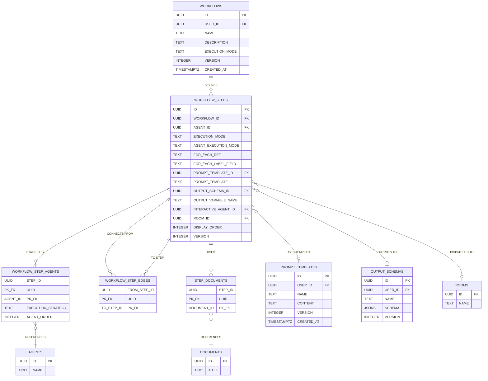
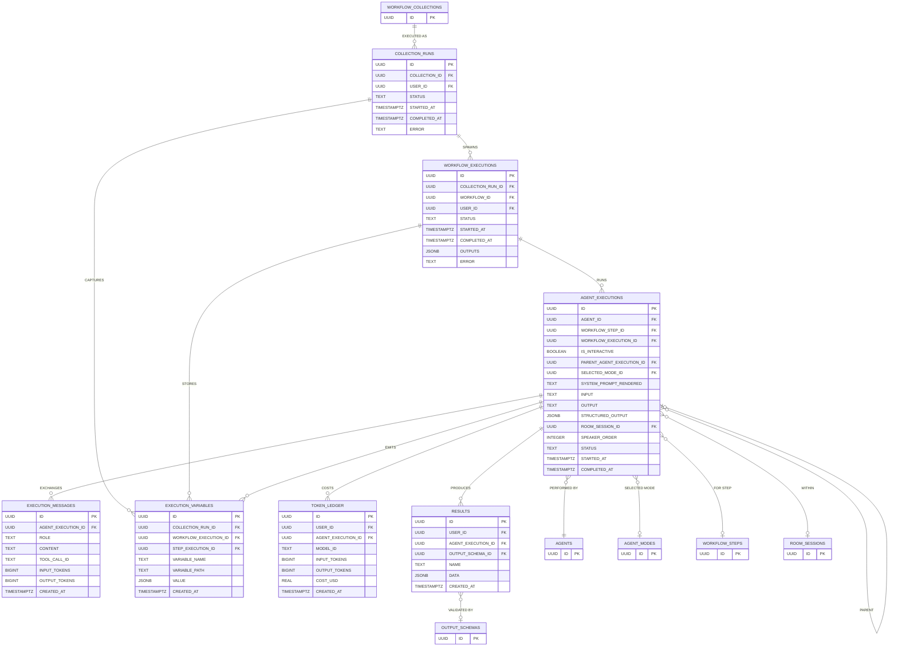
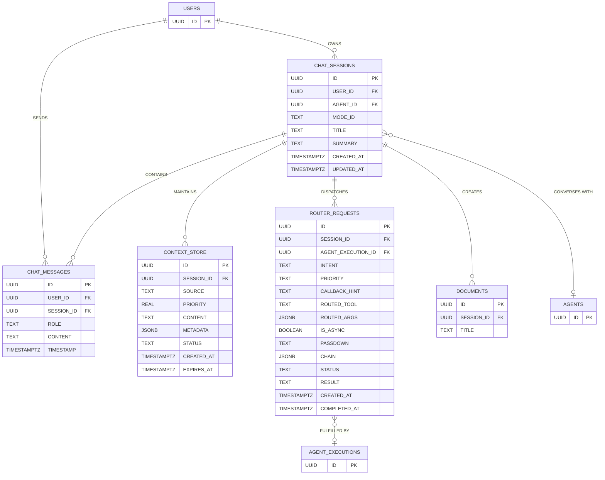
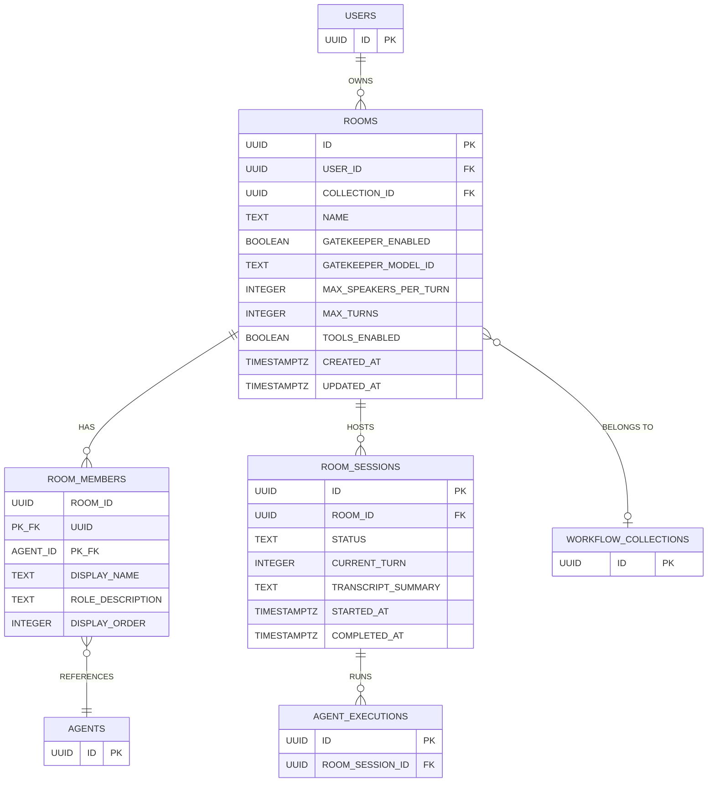
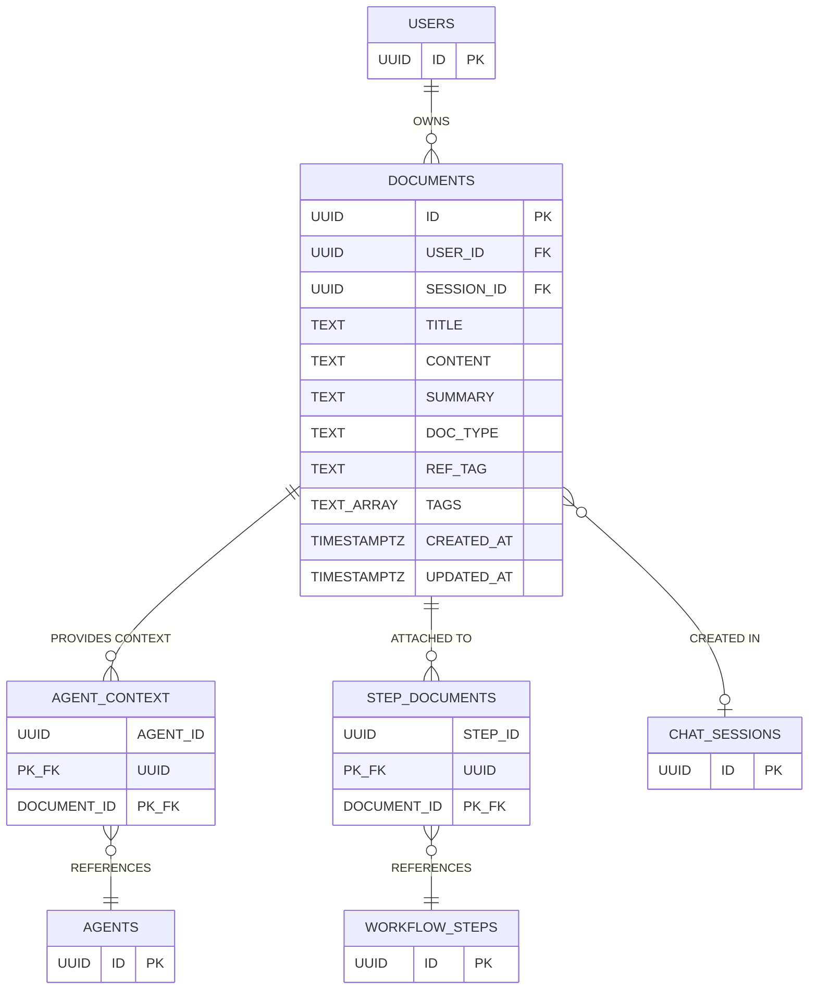
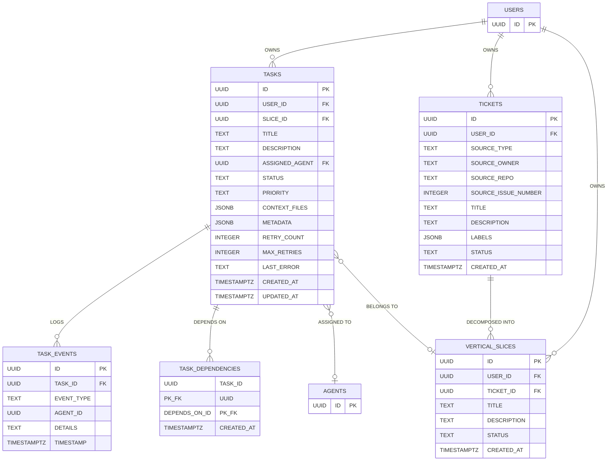

# DATABASE ENTITY RELATIONSHIP DIAGRAM

## HIGH-LEVEL OVERVIEW

```mermaid
flowchart TB
    classDef core fill:#4A90D9,stroke:#2C5F8A,color:#FFFFFF,font-weight:bold
    classDef workflow fill:#7B68EE,stroke:#5A4DB0,color:#FFFFFF,font-weight:bold
    classDef exec fill:#E67E22,stroke:#B8641A,color:#FFFFFF,font-weight:bold
    classDef chat fill:#2ECC71,stroke:#239B56,color:#FFFFFF,font-weight:bold
    classDef room fill:#E74C3C,stroke:#B83A2E,color:#FFFFFF,font-weight:bold
    classDef doc fill:#1ABC9C,stroke:#148F77,color:#FFFFFF,font-weight:bold
    classDef cost fill:#F39C12,stroke:#C47F10,color:#FFFFFF,font-weight:bold
    classDef legacy fill:#95A5A6,stroke:#717D7E,color:#FFFFFF,font-weight:bold
    classDef join fill:#8E44AD,stroke:#6C3483,color:#FFFFFF,font-weight:bold

    USERS:::core

    subgraph CORE_ENTITIES["CORE ENTITIES"]
        AGENTS:::core
        AGENT_MODES:::core
        TOOLS:::core
        TOOL_ROUTERS:::core
        CLUSTERS:::core
    end

    subgraph WORKFLOW_ENGINE["WORKFLOW ENGINE"]
        WORKFLOWS:::workflow
        WORKFLOW_STEPS:::workflow
        WORKFLOW_STEP_EDGES:::workflow
        WORKFLOW_COLLECTIONS:::workflow
    end

    subgraph EXECUTION_RUNTIME["EXECUTION RUNTIME"]
        COLLECTION_RUNS:::exec
        WORKFLOW_EXECUTIONS:::exec
        AGENT_EXECUTIONS:::exec
        EXECUTION_MESSAGES:::exec
        EXECUTION_VARIABLES:::exec
    end

    subgraph CHAT_SYSTEM["CHAT SYSTEM"]
        CHAT_SESSIONS:::chat
        CHAT_MESSAGES:::chat
        CONTEXT_STORE:::chat
        ROUTER_REQUESTS:::chat
    end

    subgraph ROOMS_SYSTEM["ROOMS"]
        ROOMS:::room
        ROOM_MEMBERS:::room
        ROOM_SESSIONS:::room
    end

    subgraph KNOWLEDGE["DOCUMENTS & SCHEMAS"]
        DOCUMENTS:::doc
        OUTPUT_SCHEMAS:::doc
        PROMPT_TEMPLATES:::doc
    end

    subgraph COST_TRACKING["COST TRACKING"]
        TOKEN_LEDGER:::cost
        RESULTS:::cost
    end

    subgraph LEGACY_TABLES["LEGACY"]
        TASKS:::legacy
        TICKETS:::legacy
        VERTICAL_SLICES:::legacy
    end

    %% USER OWNS EVERYTHING
    USERS -- "OWNS" --> AGENTS
    USERS -- "OWNS" --> TOOLS
    USERS -- "OWNS" --> TOOL_ROUTERS
    USERS -- "OWNS" --> CLUSTERS
    USERS -- "OWNS" --> WORKFLOWS
    USERS -- "OWNS" --> WORKFLOW_COLLECTIONS
    USERS -- "OWNS" --> ROOMS
    USERS -- "OWNS" --> DOCUMENTS
    USERS -- "OWNS" --> OUTPUT_SCHEMAS
    USERS -- "OWNS" --> PROMPT_TEMPLATES
    USERS -- "OWNS" --> CHAT_SESSIONS
    USERS -- "OWNS" --> TASKS
    USERS -- "OWNS" --> TICKETS

    %% AGENT CONNECTIONS
    AGENTS -- "HAS" --> AGENT_MODES
    AGENTS -. "USES" .-> TOOLS
    AGENTS -. "JOINS" .-> CLUSTERS
    AGENTS -. "ASSIGNED TO" .-> WORKFLOW_STEPS
    AGENTS -. "PARTICIPATES IN" .-> ROOMS
    AGENTS -- "PERFORMS" --> AGENT_EXECUTIONS
    AGENTS -. "REFERENCES" .-> DOCUMENTS
    AGENTS -. "CONFORMS TO" .-> OUTPUT_SCHEMAS

    %% TOOL ROUTING
    TOOL_ROUTERS -. "MANAGES" .-> TOOLS

    %% WORKFLOW CHAIN
    WORKFLOWS -- "DEFINES" --> WORKFLOW_STEPS
    WORKFLOW_STEPS -- "CONNECTED BY" --> WORKFLOW_STEP_EDGES
    WORKFLOW_STEPS -. "USES TEMPLATE" .-> PROMPT_TEMPLATES
    WORKFLOW_STEPS -. "OUTPUTS TO" .-> OUTPUT_SCHEMAS
    WORKFLOW_STEPS -. "DISPATCHES TO" .-> ROOMS

    %% COLLECTIONS
    WORKFLOW_COLLECTIONS -. "CONTAINS" .-> WORKFLOWS
    WORKFLOW_COLLECTIONS -- "EXECUTED AS" --> COLLECTION_RUNS

    %% EXECUTION CHAIN
    COLLECTION_RUNS -- "SPAWNS" --> WORKFLOW_EXECUTIONS
    WORKFLOW_EXECUTIONS -- "RUNS" --> AGENT_EXECUTIONS
    AGENT_EXECUTIONS -- "EXCHANGES" --> EXECUTION_MESSAGES
    AGENT_EXECUTIONS -- "COSTS" --> TOKEN_LEDGER
    AGENT_EXECUTIONS -- "PRODUCES" --> RESULTS
    AGENT_EXECUTIONS -- "EMITS" --> EXECUTION_VARIABLES
    RESULTS -. "VALIDATED BY" .-> OUTPUT_SCHEMAS

    %% CHAT CHAIN
    CHAT_SESSIONS -- "CONTAINS" --> CHAT_MESSAGES
    CHAT_SESSIONS -- "MAINTAINS" --> CONTEXT_STORE
    CHAT_SESSIONS -- "DISPATCHES" --> ROUTER_REQUESTS
    CHAT_SESSIONS -. "CONVERSES WITH" .-> AGENTS

    %% ROOMS CHAIN
    ROOMS -- "HAS" --> ROOM_MEMBERS
    ROOMS -- "HOSTS" --> ROOM_SESSIONS
    ROOM_SESSIONS -- "RUNS" --> AGENT_EXECUTIONS

    %% DOCUMENTS
    DOCUMENTS -. "ATTACHED TO" .-> WORKFLOW_STEPS

    %% LEGACY
    TASKS -. "ASSIGNED TO" .-> AGENTS
    TICKETS -- "DECOMPOSED INTO" --> VERTICAL_SLICES
```



---

## CORE ENTITIES

```mermaid
erDiagram
    USERS {
        UUID ID PK
        TEXT EMAIL UK
        TEXT PASSWORD_HASH
        BIGINT GITHUB_ID UK
        TEXT GITHUB_LOGIN
        TEXT GITHUB_TOKEN_ENCRYPTED
        TIMESTAMPTZ CREATED_AT
        TIMESTAMPTZ UPDATED_AT
    }

    AGENTS {
        UUID ID PK
        UUID USER_ID FK
        TEXT NAME
        TEXT SYSTEM_PROMPT
        TEXT PERSONA_STYLE
        TEXT MODEL_PROVIDER
        TEXT MODEL_ID
        INTEGER MODEL_MAX_TOKENS
        REAL MODEL_TEMPERATURE
        UUID CURRENT_TASK FK
        TEXT STATUS
        BOOLEAN ROUTER_MODE
        UUID OUTPUT_SCHEMA_ID FK
        INTEGER VERSION
        TIMESTAMPTZ CREATED_AT
    }

    AGENT_MODES {
        UUID ID PK
        UUID AGENT_ID FK
        TEXT NAME
        TEXT SYSTEM_PROMPT_SUFFIX
        DOUBLE_PRECISION TEMPERATURE_OVERRIDE
        TEXT MODEL_OVERRIDE
        TEXT_ARRAY TOOL_OVERRIDES
        TEXT CLASSIFIER_HINT
        INTEGER VERSION
        TIMESTAMPTZ CREATED_AT
    }

    TOOLS {
        UUID ID PK
        UUID USER_ID FK
        TEXT NAME
        TEXT DISPLAY_NAME
        TEXT DESCRIPTION
        JSONB PARAMETERS
        INTEGER VERSION
        TIMESTAMPTZ CREATED_AT
    }

    AGENT_TOOLS {
        UUID AGENT_ID PK_FK
        UUID TOOL_ID PK_FK
    }

    TOOL_ROUTERS {
        UUID ID PK
        UUID USER_ID FK
        TEXT NAME
        TEXT DESCRIPTION
        TEXT SYSTEM_PROMPT
        TEXT MODEL_ID
        BOOLEAN IS_ACTIVE
        TIMESTAMPTZ CREATED_AT
        TIMESTAMPTZ UPDATED_AT
    }

    TOOL_ROUTER_TOOLS {
        UUID ROUTER_ID PK_FK
        UUID TOOL_ID PK_FK
    }

    CLUSTERS {
        UUID ID PK
        UUID USER_ID FK
        TEXT NAME
        TEXT DESCRIPTION
        TEXT CONVENTIONS
        JSONB SHARED_FILES
        TIMESTAMPTZ CREATED_AT
    }

    CLUSTER_MEMBERS {
        UUID CLUSTER_ID PK_FK
        UUID AGENT_ID PK_FK
        TEXT ROLE
        TEXT PERSONA_OVERRIDE
        TIMESTAMPTZ JOINED_AT
    }

    OUTPUT_SCHEMAS {
        UUID ID PK
        UUID USER_ID FK
        TEXT NAME
        JSONB SCHEMA
        INTEGER VERSION
        TIMESTAMPTZ CREATED_AT
    }

    USERS ||--o{ AGENTS : "OWNS"
    USERS ||--o{ TOOLS : "OWNS"
    USERS ||--o{ TOOL_ROUTERS : "OWNS"
    USERS ||--o{ CLUSTERS : "OWNS"
    USERS ||--o{ OUTPUT_SCHEMAS : "OWNS"
    AGENTS ||--o{ AGENT_MODES : "HAS MODES"
    AGENTS ||--o{ AGENT_TOOLS : "USES"
    AGENTS ||--o{ CLUSTER_MEMBERS : "JOINS"
    AGENTS }o--o| OUTPUT_SCHEMAS : "CONFORMS TO"
    TOOLS ||--o{ AGENT_TOOLS : "ASSIGNED VIA"
    TOOLS ||--o{ TOOL_ROUTER_TOOLS : "ROUTED VIA"
    TOOL_ROUTERS ||--o{ TOOL_ROUTER_TOOLS : "MANAGES"
    CLUSTERS ||--o{ CLUSTER_MEMBERS : "CONTAINS"
```



---

## WORKFLOW ENGINE



---

## COLLECTIONS (DAG OF WORKFLOWS)

```mermaid
erDiagram
    WORKFLOW_COLLECTIONS {
        UUID ID PK
        UUID USER_ID FK
        TEXT NAME
        TEXT DESCRIPTION
        TEXT EXECUTION_MODE
        TIMESTAMPTZ CREATED_AT
        TIMESTAMPTZ UPDATED_AT
    }

    COLLECTION_WORKFLOWS {
        UUID COLLECTION_ID PK_FK
        UUID WORKFLOW_ID PK_FK
        INTEGER DISPLAY_ORDER
        TEXT EXECUTION_MODE
    }

    COLLECTION_WORKFLOW_EDGES {
        UUID FROM_WORKFLOW_ID PK_FK
        UUID TO_WORKFLOW_ID PK_FK
        UUID COLLECTION_ID PK_FK
    }

    WORKFLOWS {
        UUID ID PK
        TEXT NAME
        TEXT EXECUTION_MODE
    }

    USERS {
        UUID ID PK
    }

    ROOMS {
        UUID ID PK
        TEXT NAME
        UUID COLLECTION_ID FK
    }

    USERS ||--o{ WORKFLOW_COLLECTIONS : "OWNS"
    WORKFLOW_COLLECTIONS ||--o{ COLLECTION_WORKFLOWS : "CONTAINS"
    WORKFLOW_COLLECTIONS ||--o{ COLLECTION_WORKFLOW_EDGES : "CONNECTS"
    WORKFLOW_COLLECTIONS ||--o{ ROOMS : "HOSTS"
    COLLECTION_WORKFLOWS }o--|| WORKFLOWS : "REFERENCES"
    COLLECTION_WORKFLOW_EDGES }o--|| WORKFLOWS : "FROM WORKFLOW"
    COLLECTION_WORKFLOW_EDGES }o--|| WORKFLOWS : "TO WORKFLOW"
```

---

## EXECUTION RUNTIME



---

## CHAT SYSTEM



---

## ROOMS (MULTI-AGENT DISCUSSIONS)



---

## DOCUMENTS & KNOWLEDGE



---

## LEGACY TABLES



---

## VERSION HISTORY TABLES

THE FOLLOWING TABLES HAVE ASSOCIATED `_VERSIONS` HISTORY TABLES THAT TRACK ALL CHANGES:

| ENTITY TABLE | VERSION TABLE | TRACKS |
|---|---|---|
| **AGENTS** | **AGENTS_VERSIONS** | NAME, SYSTEM_PROMPT, MODEL CONFIG, ETC. |
| **AGENT_MODES** | **AGENT_MODES_VERSIONS** | MODE DEFINITIONS AND OVERRIDES |
| **TOOLS** | **TOOLS_VERSIONS** | TOOL DEFINITIONS AND PARAMETERS |
| **WORKFLOWS** | **WORKFLOWS_VERSIONS** | WORKFLOW NAME, DESCRIPTION, MODE |
| **WORKFLOW_STEPS** | **WORKFLOW_STEPS_VERSIONS** | STEP CONFIG, TEMPLATES, SCHEMAS |
| **OUTPUT_SCHEMAS** | **OUTPUT_SCHEMAS_VERSIONS** | JSON SCHEMA DEFINITIONS |
| **PROMPT_TEMPLATES** | **PROMPT_TEMPLATES_VERSIONS** | TEMPLATE CONTENT |

EACH VERSION TABLE CONTAINS: `ID`, `VERSION`, ALL ENTITY COLUMNS, `CHANGED_BY` (UUID), `CHANGED_AT` (TIMESTAMPTZ)

---

## RELATIONSHIP LEGEND

| SYMBOL | MEANING |
|---|---|
| `\|\|--o{` | ONE TO MANY (SOLID LINE) |
| `}o--o\|` | MANY TO ZERO-OR-ONE (OPTIONAL FK) |
| `}o--\|\|` | MANY TO ONE (REQUIRED FK) |
| `--` SOLID ARROW | DIRECT OWNERSHIP / REQUIRED RELATIONSHIP |
| `-.` DOTTED ARROW | CROSS-DOMAIN / OPTIONAL REFERENCE |
