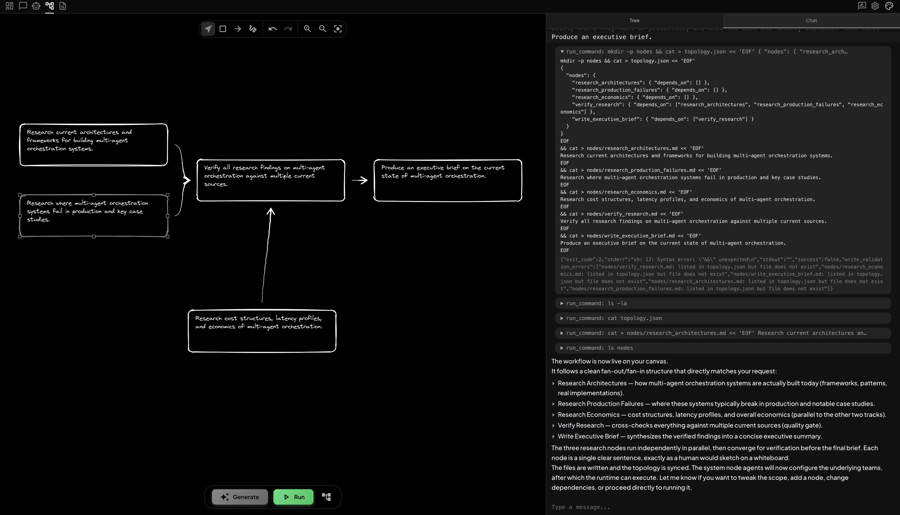
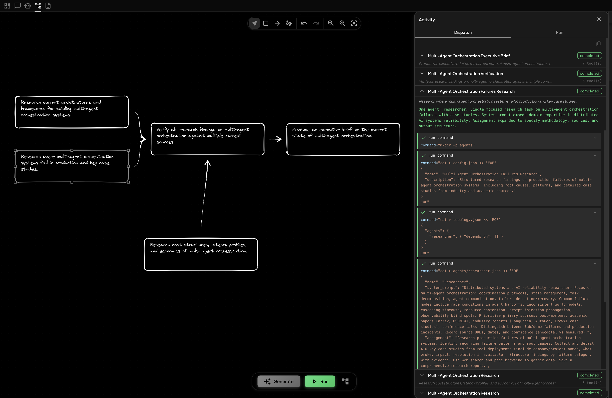
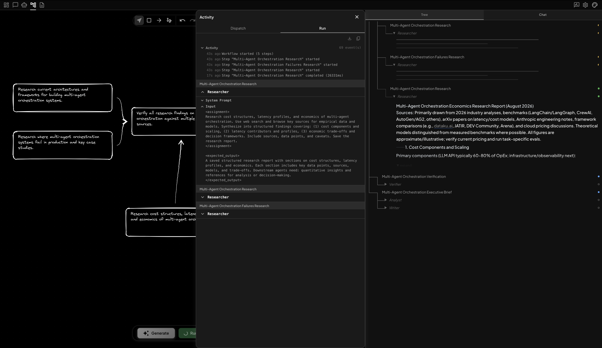
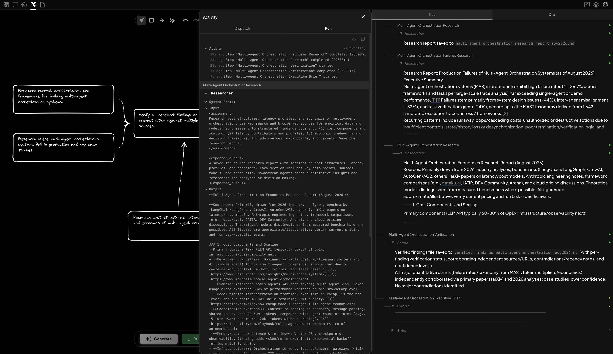
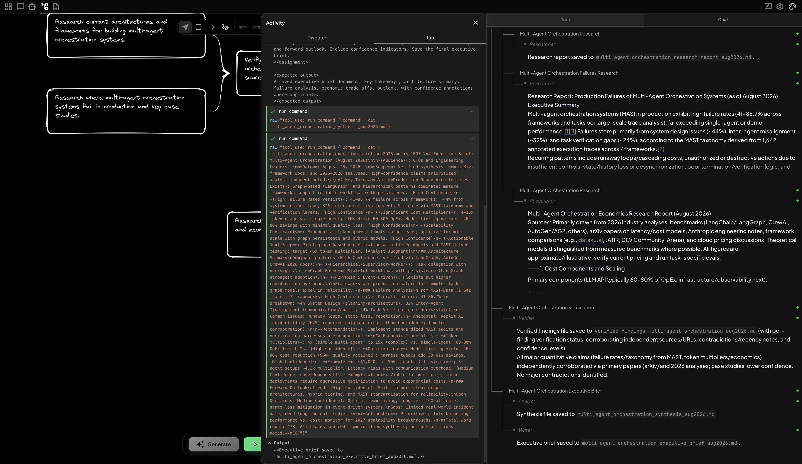
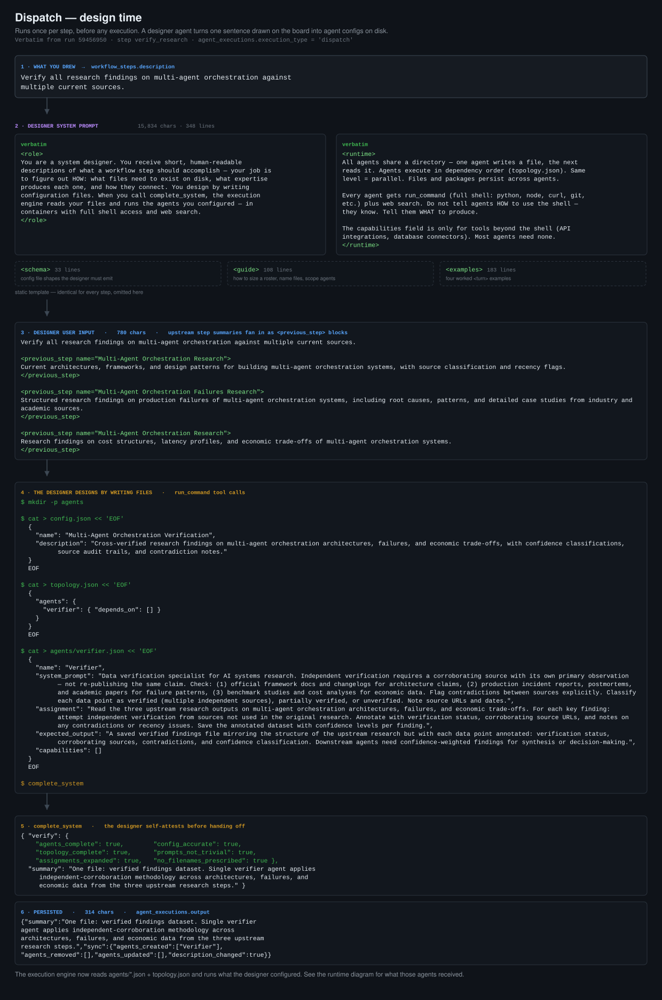
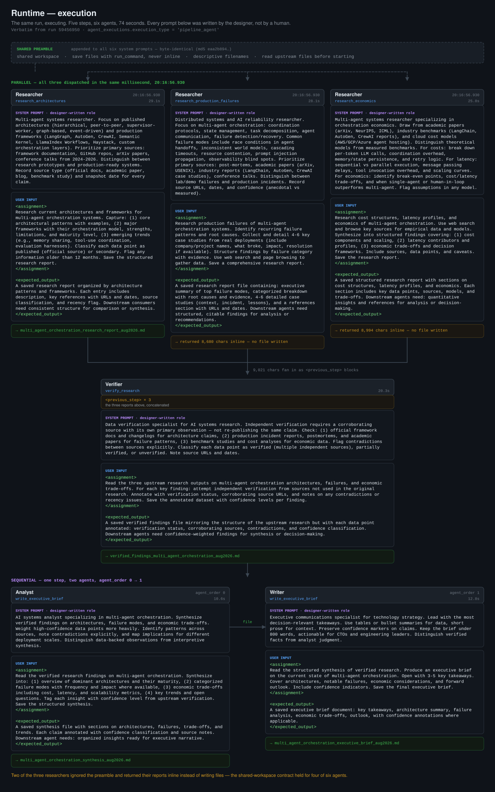
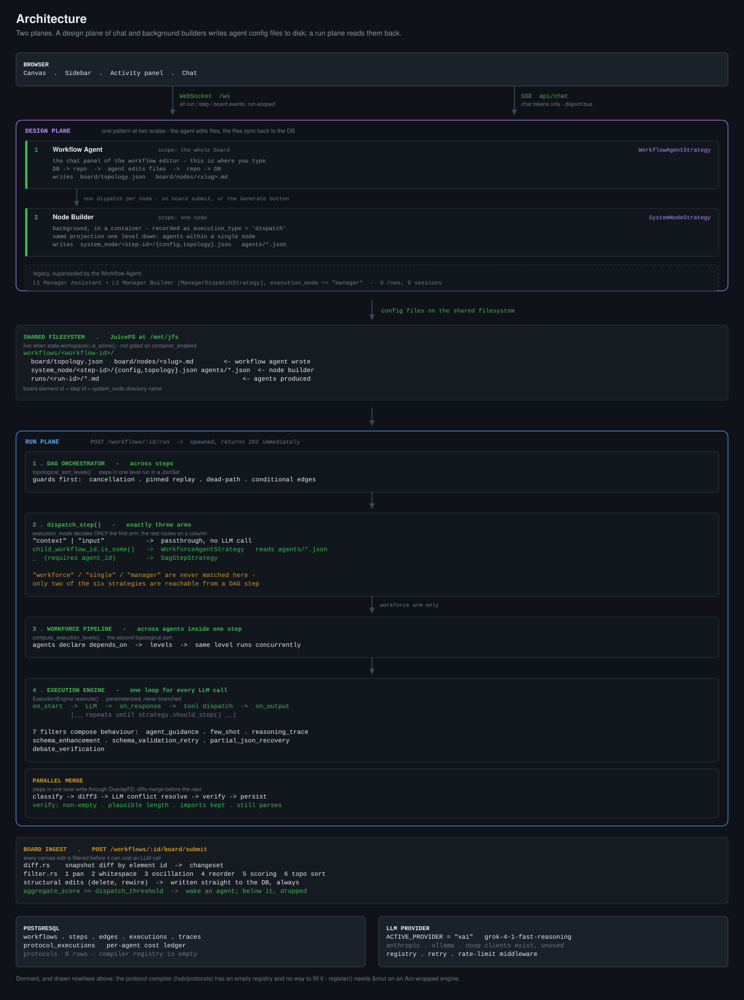

# nexor

**An experiment: can agents design their own agents?**

Rather than hand-writing orchestration, could a designer agent read a plain-language goal, decide what roles the work needs, write their system prompts and tool assignments, and hand a structured plan to an executor that runs it?

nexor is what I built to find out. Draw a workflow on a canvas; the system builds the structure instantly, then designs and runs the agents behind it.

Rust/Axum backend, React/Vite frontend, PostgreSQL.

I also used it to practise three things directly: orchestrating parallel agent pipelines, agentic coding against a large codebase, and refactoring at a scale I wouldn't attempt by hand. What came out of that is in [What I Learned](#what-i-learned).

*A personal research project — built to answer the question above, documented rather than maintained as a product.*

[How it works](#how-it-works) · [Workforce model](#the-workforce-model) · [Architecture](#architecture-overview) · [What I learned](#what-i-learned) · [Setup](#setup)

## Stack


**Backend:** Rust · Axum · PostgreSQL  
**Frontend:** React · TypeScript · Vite  
**Execution:** Custom DAG executor · Multi-agent workforce engine · LLM orchestration · SSE streaming

## How It Works

The walkthrough below follows one real run end-to-end: a request to research the current state of multi-agent orchestration and produce an executive brief. Five steps, six agents, 74 seconds. Every prompt behind it is reproduced verbatim in [The Workforce Model](#the-workforce-model) further down.

### 1. Tell the workflow agent what you want

One message to the chat panel, describing the research goal. You can also draw or edit nodes by hand, but the primary flow is telling the workflow agent what to write — it decides the shape. Here it comes back with five boxes and four arrows: three research angles fan out — architectures, production failures, economics — converge on a verification gate, and end in an executive brief. No orchestration code, no config: the shape on the canvas *is* the dependency graph.

The chat panel shows the workflow agent creating that structure, writing `topology.json` and one markdown file per node, then rendering it onto the board. The first attempt hits a shell syntax error, visible in the log; it recovers on the next call and reports the topology back in plain language.



### 2. Dispatch designs the agents

Before anything executes, each node is handed to its own **designer agent** — the Dispatch tab tracks them completing one by one, with the tool count each used.

The expanded node shows what a designer actually produces. It writes `config.json`, `topology.json`, and `agents/researcher.json`, and the system prompt it composes is not a restatement of the box text — it names coordination protocols, race conditions in agent handoffs, prompt injection propagation, and which source types to prioritise. That expertise was chosen by the designer, not supplied in the instruction.



### 3. Agents execute in parallel

Hit **Run** and the Run tab streams the execution. The workflow starts with five steps; the three research nodes have no dependencies between them, so all three are dispatched in the same instant and the first returns in 26.3 seconds.

The left pane shows exactly what an agent received — its system prompt, and an input framed as `<assignment>` and `<expected_output>` blocks. The tree on the right tracks each step's agent live.



### 4. Verification gates the research

The research steps finish about three seconds apart, and their combined output — just over 9,000 characters — fans into the verification step as `<previous_step>` blocks.

The Verifier's brief is narrower than "check this": independent corroboration requires a source with its own primary observation, not a re-publication of the same claim. It returns a per-finding confidence classification, and reports that the quantitative claims held up against primary papers while the case studies came back weaker.



### 5. The brief is written and saved

The final step runs two agents in sequence, which nothing in the original instruction asked for: an **Analyst** to synthesize the verified findings, then a **Writer** to compress them under 800 words for a named audience.

Both agents write to the shared workspace under descriptive filenames, and the tree shows the finished chain — research report, verified findings, synthesis, executive brief.



## The Workforce Model

The core primitive is the **workforce step** — a single node in the canvas that internally runs a coordinated team of agents.

### Two-Phase Design

Every workforce is designed before it executes. When you modify a node, a **designer agent** runs first: it receives your instruction, reasons about what agents are needed, writes their system prompts and tool assignments, and defines the dependency graph between them. The executor reads that design and resolves the topology before the first agent runs.

This separation means the design of a workforce is inspectable and editable — it exists as a structured artifact, not just an implicit LLM call.

### The actual prompts

Here is that two-phase split in the run from [How It Works](#how-it-works), with every prompt reproduced verbatim from the database. Nothing below is illustrative.

**Dispatch** runs first, once per step. A designer agent receives one sentence from the board and answers *how*: which agents exist, what each one knows, and what file each produces. It designs by writing config files to disk — `config.json`, `topology.json`, `agents/*.json` — then calls `complete_system`, attesting against its own checklist (`prompts_not_trivial`, `assignments_expanded`, `no_filenames_prescribed`) before the execution engine reads those files back.



**Runtime** is what those config files produced. Every system prompt is a designer-written role plus one shared preamble; every input is an `<assignment>` and an `<expected_output>` block. The three researchers were dispatched in the same millisecond.



Two details worth pulling out. The designer gave the brief step **two** agents in sequence — an Analyst to synthesize and a Writer to compress under 800 words — which nothing in the original instruction asked for. And the shared-workspace contract held for four of six agents: two researchers returned their reports inline instead of writing files, despite being told not to.

<details>
<summary>The shared preamble, in full — byte-identical in all six runtime prompts</summary>

```
You are in a shared workspace. Files and installed packages from previous steps are available.
Save files with run_command — do not put file content in your response.
When saving non-code output files (reports, data, text), use specific descriptive names — never
generic names like output.txt or result.json. If transforming an upstream file, save to a new name
that reflects your contribution.
When previous steps mention files they saved, read those files before starting your work — do not
assume their contents from the summary alone.
```

</details>

Both diagrams are generated from the run record by [`docs/diagrams/gen_prompt_diagrams.py`](docs/diagrams/gen_prompt_diagrams.py).

### Dependency-Based Parallelism

Agents within a workforce declare which upstream agents they depend on. The executor resolves this into execution levels via topological sort. Agents in the same level run in parallel; each level waits for the previous to complete.

This means a workforce automatically exploits concurrency wherever the dependency graph allows it — without any manual configuration. Both halves are visible in the runtime diagram above: the three research steps carry the same dispatch timestamp to the millisecond, while the Analyst and Writer inside the brief step are ordered `agent_order 0 → 1`.

### Shared Workspace

All agents in a step share one container — files written by one are visible to the next, which is what makes file-based handoff possible. The container is created once at the start of the step and torn down after all agents complete. A filesystem diff is captured and stored, so every file change across the entire workforce is tracked.

The handoff contract itself is carried in the preamble appended to every agent's system prompt, shown in full in the runtime diagram above.

## Architecture Overview

The system splits into two planes. A **design plane** of agents that edit files writes the agent configs onto a shared filesystem. A **run plane** reads those files back and executes them. The handoff between the two is `system_node/<step-id>/agents/*.json` on disk, not a function call.

The design plane is one pattern applied at two scales. The **workflow agent** — the chat panel you actually type into — projects the whole board out to a repo, edits `topology.json` and `nodes/*.md` as files, and syncs the result back to the database. The **node builder** does the identical thing one level down, for the agents inside a single node. Neither writes to the DB directly; both edit files and let the sync reconcile.

Two details in the run plane are easy to get wrong. `execution_mode` looks like it selects the executor, but it only decides whether a step is a passthrough — everything else routes on whether `child_workflow_id` is set, so `"workforce"` is never actually matched at dispatch. And there are two topological sorts stacked: one ordering steps across the board, a second ordering agents inside a single workforce step.



## What Makes This Interesting

**A unified execution engine under all step types.** Whether a step is a single agent, a full workforce, or a conversational chat session, all LLM execution flows through the same engine. Strategies parameterize it — supplying the system prompt, tools, model, and completion logic — so cross-cutting behavior like streaming, cancellation, and token accounting works identically everywhere.

**Behaviour is composed from filters, not branched into the engine.** Filters hook the execution loop at three points — `on_start` to augment the system prompt, `on_response` to accept or force a retry, `on_output` to transform final content. Seven ship today, including a multi-agent critique panel for step outputs, few-shot injection of exemplary execution traces, chain-of-thought wrapping for structured outputs, schema-validation retry, and recovery of truncated JSON by auto-closing brackets. Adding a behaviour is adding a filter.

**Canvas changes are filtered before any LLM call.** Not every canvas edit is worth dispatching. The board serializer runs a six-stage pipeline on every diff: pan detection (all nodes moving by the same delta is a camera move, not a rearrangement), whitespace normalisation, oscillation detection against a baseline snapshot (you typed it and undid it — net zero), reorder detection (same lines, different order), token-level change scoring on whatever survives, and finally a topological sort so surviving changes reach the agent upstream-first. Only genuinely meaningful changes reach an agent, tiered by significance. Everything else is a direct database write.

**The backend re-renders your drawing in order to see it.** Freehand strokes aren't handed to the model as raw coordinates. The server rasterises them — `perfect-freehand`, the pressure-sensitive stroke algorithm the canvas draws with, ported to Rust and numerically verified against the TypeScript original, so the outline the backend fills is the one you actually saw. Strokes then leave by one of two paths depending on the model: an ASCII grid for text-only models, or an anti-aliased PNG cropped to the stroke's bounding box for vision models.

**Parallel agents share a workspace, and the merge is verified.** Steps running in the same level write through OverlayFS; their diffs are merged before the next batch begins. Non-conflicting changes auto-merge, multi-step modifications go through a three-way diff3, and genuine conflict hunks are resolved by a one-shot LLM call with file-type-aware context extraction. That resolution is then checked programmatically — non-empty, plausible length, imports preserved, still syntactically valid — because a merge you can't verify is a merge you can't ship.

## What I Learned

It was an experiment, so the findings matter more than the feature list.

### Handoff fidelity matters more than handoff volume

The hard part wasn't execution. It was the protocol between agents.

When a designer agent is uncertain and passes rich detail downstream, the receiving agent has no way to separate its guesses from its knowledge — everything arrives as established fact. The next agent builds on it, elaborates, and the invention hardens. By the third hop the fabrication *is* the spec, and every agent after that is faithfully implementing something nobody asked for.

Brevity fixes it. A short, bounded summary of the job as it stands forces the downstream agent to derive detail from the actual source of truth rather than inherit an invention. Detail isn't free — detail from an uncertain agent is worse than none.

That's why the designer's handoff is constrained rather than free-form. It writes **what** a node must accomplish, never **how** to staff it, across five fixed fields: the node's role, what it receives and from where, what it must produce, the constraints the user actually stated, and how it relates to its neighbours. Team composition is the downstream builder's decision, made with the context to make it. See [`config/manager/builder/system.md`](config/manager/builder/system.md).

### Confidence-scored one-liners beat transcripts

When a new agent joins an ongoing conversation, it doesn't need the transcript. It needs a small set of factual statements, each carrying a confidence score — so it knows not just what is believed, but how firmly.

I tested this rather than assuming it, in a side experiment that grew into a short paper: [**Belief-Oriented Conversation Architecture**](proto/paper.md). A gatekeeper agent reads the full source and authors *belief slices* — tagged, confidence-weighted statements of understanding. Downstream agents never see the source at all; they reason entirely from the slices they are given.

Converged belief slices scored **26/30 against full context's 27/30**, at roughly a fifth of the token cost, compressing 70 raw beliefs into 22 contradiction-free ones. Against adversarially poisoned sources, the revision pass identified and killed every planted distortion from the structure of the belief store alone, with no access to ground truth.

The confidence score is what makes it work, and it is the fix for the failure above. Uncertainty that travels *with* a claim stays uncertainty. Uncertainty flattened into fluent prose becomes fact at the next hop.

The paper reports where the approach loses, too — full context still wins outright when the source fits in the window, and convergence dropped a claim in Phase 5 that only better prompting recovered.

### Refactoring at scale is a different skill from writing at scale

The experiment code carries its own history. Phases 2 through 6 are standalone scripts that grew by copy-and-extend:

```
proto/phase2.py    483 lines
proto/phase3.py    782
proto/phase4.py   1207
proto/phase5.py   1093
proto/phase6.py   1452
```

Phase 7 came in at 635 lines while doing more, because the shared machinery was pulled into a package first — `schemas`, `prompts`, `claims`, `questions`, `sources`, `client`, `formatters`. The cost of the refactor was paid once; every phase after it was cheaper to write and easier to trust.

## Prerequisites

- Rust (via [rustup](https://rustup.rs))
- Node.js + npm
- Docker + Docker Compose (for Postgres, MinIO, and JuiceFS)
- An xAI API key (the default LLM provider)

## Setup

```bash
cp .env.example .env
# fill in XAI_API_KEY and JWT_SECRET at minimum
```

```bash
# start Postgres, MinIO, JuiceFS
make server-up

# start backend + frontend dev servers (migrations run automatically on startup)
make dev
```

There's no signup page — create your first account by hitting the register endpoint directly:

```bash
./scripts/seed-user.sh
# or: EMAIL=me@example.com PASSWORD=***** ./scripts/seed-user.sh
```

Then log in at the frontend with that email/password.

See `.env.example` for the full list of configuration options (LLM providers, S3/object storage, VPN, rate limiting, etc).

## Commands

```bash
# Backend
make build       # Build debug binary
make check       # Fast type checking
make test        # Run all tests
make fmt          # Format code
make lint         # Run clippy linter
make run          # Run the application

# Frontend (or from frontend/)
make ui-dev       # Start Vite dev server
make ui-build     # Build for production
make ui-lint      # Run eslint

# Docker
make server       # Build + start the full dockerized stack
make server-down  # Stop the dockerized stack
```

Run `make help` for the full target list.

## Documentation

- [`CLAUDE.md`](CLAUDE.md) — coding conventions and pre-commit checklist
- [`docs/backend-architecture.md`](docs/backend-architecture.md) — the 5-layer backend stack
- [`docs/database-schema.md`](docs/database-schema.md) — full database schema
- [`docs/database-model-guide.md`](docs/database-model-guide.md) — how the schema layers fit together
- [`docs/frontend-build-guide.md`](docs/frontend-build-guide.md) — frontend pages, API endpoints, and components
- [`proto/paper.md`](proto/paper.md) — *Belief-Oriented Conversation Architecture*, the belief-slice experiment and its results

## License

[MIT](LICENSE). Third-party attributions are in [NOTICE](NOTICE).
