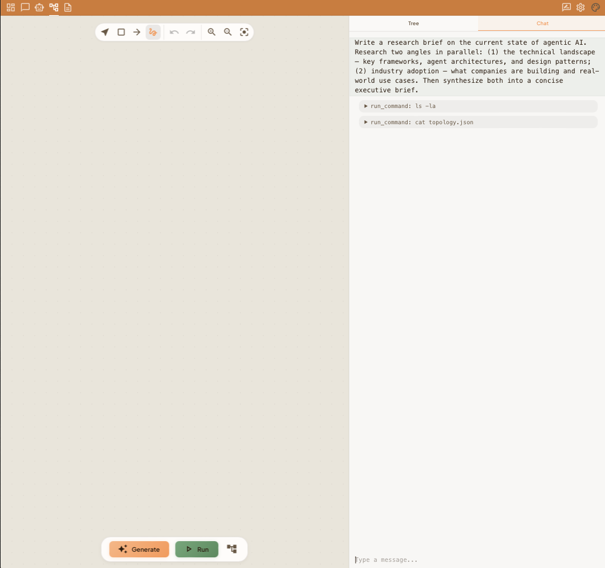
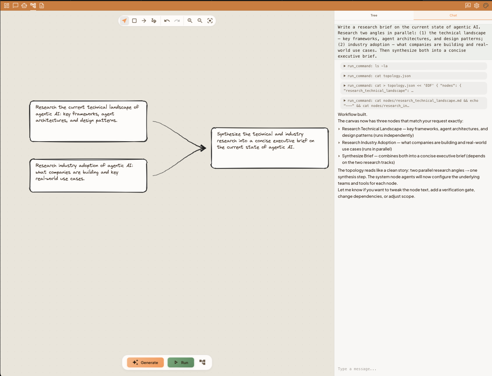
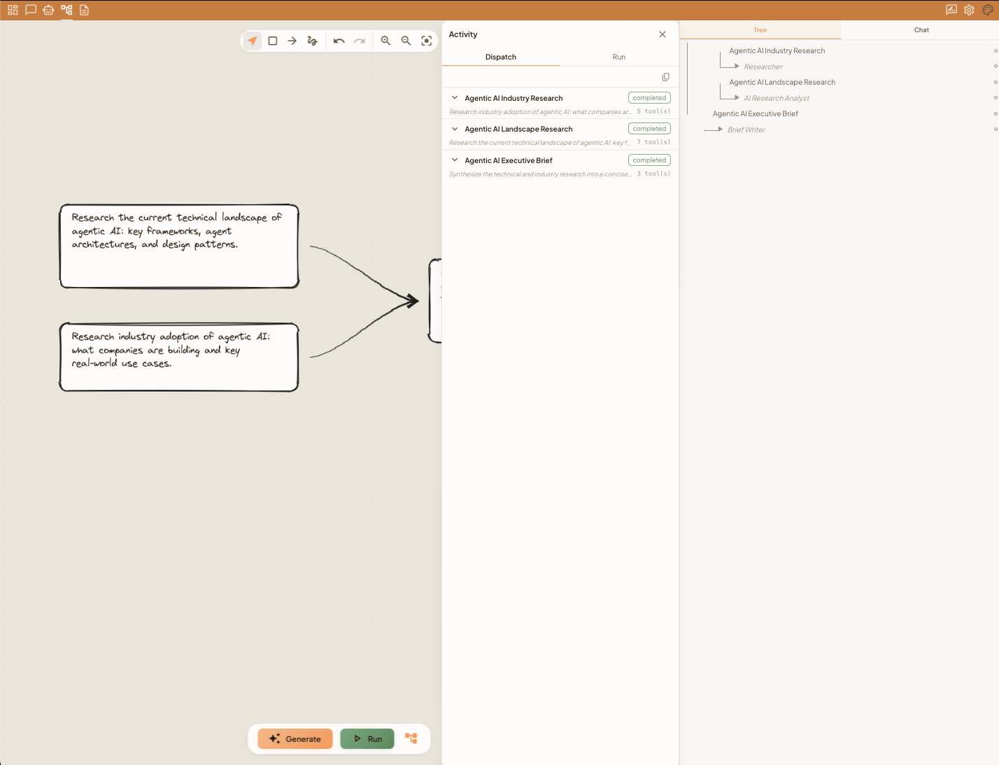
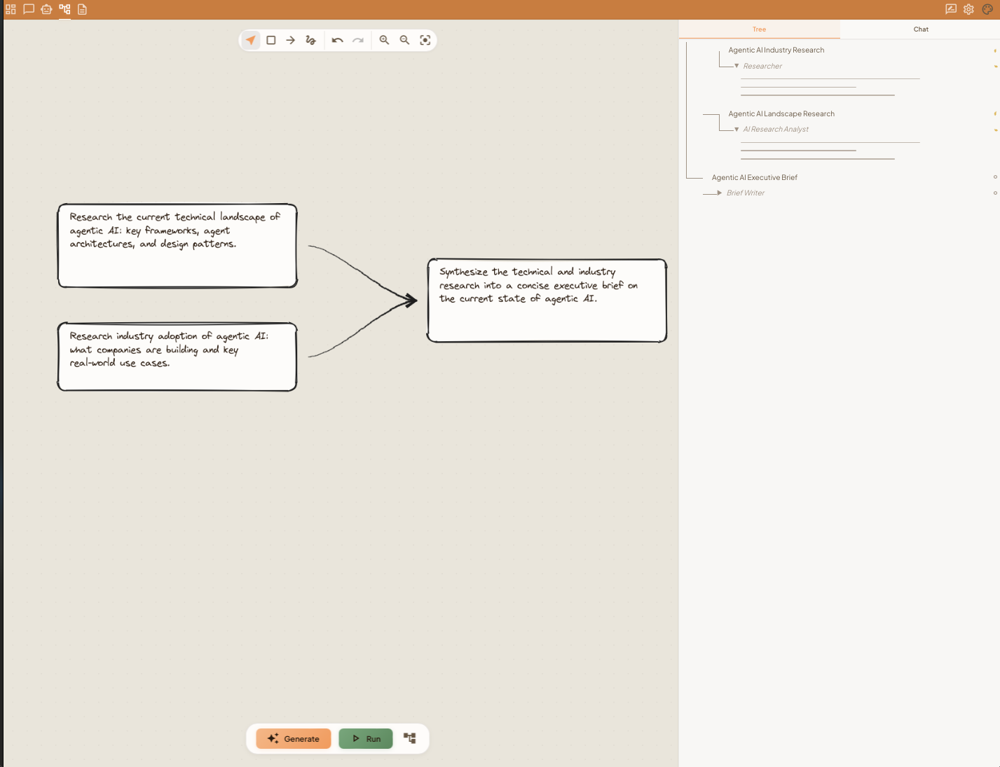
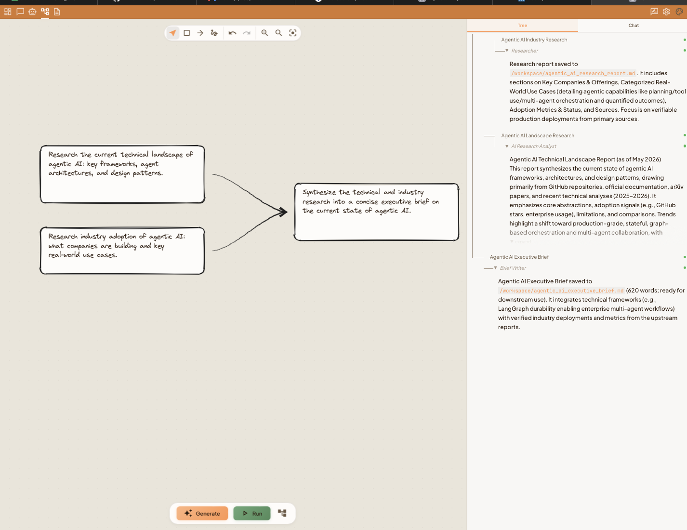

# nexor

Visual workflow design platform for AI agents. Draw workflows on an Excalidraw canvas, and the system builds the structure instantly, then designs the agents that run it asynchronously.

Rust/Axum backend, React/Vite frontend, PostgreSQL.

## Stack


**Backend:** Rust · Axum · PostgreSQL  
**Frontend:** React · TypeScript · Vite  
**Execution:** Custom DAG executor · Multi-agent workforce engine · LLM orchestration · SSE streaming

## How It Works

The walkthrough below follows one real run end-to-end: a request to research the current state of agentic AI and produce an executive brief.

### 1. Describe your goal in plain language

Type what you want the system to build — no orchestration code required. Here the prompt asks for two research angles in parallel (technical landscape and industry adoption), synthesized into a single brief. The workflow agent reads the intent and starts planning the agent graph, using tools like `run_command` to inspect the board before making changes.



### 2. The system generates a structured agent graph

A DAG appears on the canvas: two independent research nodes feed into a synthesis node. The chat panel confirms the topology in plain language — "two parallel research angles → one synthesis step" — and offers to tweak node text, add a verification gate, change dependencies, or adjust scope.



### 3. Hit Run — dispatch tracked node by node

Hit **Run**. The Activity panel's Dispatch tab shows each node being handed off to its own workforce — *Agentic AI Industry Research → Researcher*, *Agentic AI Landscape Research → AI Research Analyst*, *Agentic AI Executive Brief → Brief Writer* — marking each `completed` as it finishes, along with how many tools it used.



### 4. Agents execute in parallel — tracked in real time

Switch to the Tree tab to watch the same run at the agent level. Each node expands to show its underlying agent with a live status indicator, so independent branches (Researcher, AI Research Analyst) can be seen progressing simultaneously before the downstream Brief Writer starts.



### 5. Results stream back as each agent completes

As agents finish, their outputs stream directly into the tree: file paths written to the shared workspace, summaries of what each report contains, and word counts. The final agent (Brief Writer) receives only the outputs it depends on and synthesizes them into the finished executive brief.



## The Workforce Model

The core primitive is the **workforce step** — a single node in the canvas that internally runs a coordinated team of agents.

### Two-Phase Design

Every workforce is designed before it executes. When you modify a node, a **designer agent** runs first: it receives your instruction, reasons about what agents are needed, writes their system prompts and tool assignments, and defines the dependency graph between them. The executor reads that design and resolves the topology before the first agent runs.

This separation means the design of a workforce is inspectable and editable — it exists as a structured artifact, not just an implicit LLM call.

```
 ┌───────────────────────────────────┐
 │         User instruction          │
 │                                   │
 │  "Research the latest trends in   │
 │   AI safety and write a report"   │
 └───────────────┬───────────────────┘
                 │  plain language goal
                 ▼
 ┌───────────────────────────────────┐
 │         Designer Agent            │
 │                                   │
 │  · Decides which agents are needed│
 │  · Writes system prompts per agent│
 │  · Defines dependency graph       │
 │  · Assigns tools per agent        │
 └───────────────┬───────────────────┘
                 │  structured design
                 ▼
 ┌───────────────────────────────────┐
 │         Workforce Executor        │
 │                                   │
 │  · Reads design                   │
 │  · Topological sort → levels      │
 │  · Agents in same level run in    │
 │    parallel (tokio JoinSet)       │
 │  · Cross-agent output routing     │
 └───────────────────────────────────┘
```

### Dependency-Based Parallelism

Agents within a workforce declare which upstream agents they depend on. The executor resolves this into execution levels via topological sort. Agents in the same level run in parallel; each level waits for the previous to complete.

```
 Level 0:  [Researcher]                 ← no dependencies, runs first
 Level 1:  [Analyst] [Summarizer]       ← both depend on Researcher, run in parallel
 Level 2:  [Writer]                     ← depends on both, runs last
```

This means a workforce automatically exploits concurrency wherever the dependency graph allows it — without any manual configuration.

### Shared Workspace

When a workforce runs in a containerized environment, all agents in the step share a single workspace. Files written by one agent are visible to the next. This enables file-based handoff — an agent can produce a document, code file, or structured artifact, and a downstream agent reads and builds on it directly.

The container is created once at the start of the step and torn down after all agents complete. A filesystem diff is captured and stored, so every file change across the entire workforce is tracked.

## Architecture Overview

```
 ┌─────────────────────────────────────────────────┐
 │                    Browser                      │
 │    Canvas  ·  Sidebar  ·  Activity panel        │
 │              ▲ SSE stream                       │
 └──────────────┼──────────────────────────────────┘
                │ HTTP / SSE
 ┌──────────────┼──────────────────────────────────┐
 │           Rust / Axum API                       │
 │                                                 │
 │  ┌──────────────────────────────────────────┐   │
 │  │             Execution Hub                │   │
 │  │                                          │   │
 │  │  DAG Orchestrator                        │   │
 │  │  · Topological sort                      │   │
 │  │  · Level-based parallelism               │   │
 │  │  · Port-based typed data flow            │   │
 │  │  · Conditional edge pruning              │   │
 │  │            │                             │   │
 │  │            ▼                             │   │
 │  │  Step Dispatch                           │   │
 │  │  · pass-through  (context/input nodes)   │   │
 │  │  · workforce     (multi-agent team)      │   │
 │  │  · single agent  (standard step)         │   │
 │  │            │                             │   │
 │  │            ▼                             │   │
 │  │  Execution Engine  (unified LLM loop)    │   │
 │  │  · Pluggable strategies per step type    │   │
 │  │  · Tool dispatch + multi-round loops     │   │
 │  │  · Composable response filter pipeline   │   │
 │  │  · Streaming via SSE sink                │   │
 │  └──────────────────────────────────────────┘   │
 │                                                 │
 │  Board Serializer  →  Noise Filter  →  Dispatch │
 │  (canvas diffs)       (multi-stage)   (LLM/DB)  │
 └─────────────────────────────────────────────────┘
          │                       │
 ┌────────┴────────┐    ┌─────────┴────────┐
 │   PostgreSQL    │    │   LLM Providers  │
 └─────────────────┘    └──────────────────┘
```

## What Makes This Interesting

**Agents are designed by an agent.** The workforce designer runs before execution. It determines what roles are needed, writes the system prompts and tool assignments for each agent, and defines the dependency graph. The executor then reads that structured design and runs it — the "what" is separated from the "how."

**Dependency-aware parallelism without configuration.** The executor derives execution levels from the dependency graph automatically. No manual parallelism configuration — if two agents don't depend on each other, they run at the same time.

**A unified execution engine under all step types.** Whether a step is a single agent, a full workforce, or a conversational chat session, all LLM execution flows through the same engine. Strategies parameterize it — supplying the system prompt, tools, model, and completion logic — so cross-cutting behavior like streaming, filter pipelines, cancellation, and token accounting works identically everywhere.

**Canvas changes are filtered before any LLM call.** Not every canvas edit is worth dispatching. The board serializer runs a multi-stage noise pipeline on every diff — detecting accidental pans, undo oscillations, whitespace rewrites, and low-significance edits. Only genuinely meaningful changes reach an agent. Everything else is a direct database write.

## Prerequisites

- Rust (via [rustup](https://rustup.rs))
- Node.js + npm
- Docker + Docker Compose (for Postgres, MinIO, and JuiceFS)
- An xAI API key (the default LLM provider)

## Setup

```bash
cp .env.example .env
# fill in XAI_API_KEY and JWT_SECRET at minimum
```

```bash
# start Postgres, MinIO, JuiceFS
make server-up

# start backend + frontend dev servers (migrations run automatically on startup)
make dev
```

See `.env.example` for the full list of configuration options (LLM providers, S3/object storage, VPN, rate limiting, etc).

## Commands

```bash
# Backend
make build       # Build debug binary
make check       # Fast type checking
make test        # Run all tests
make fmt          # Format code
make lint         # Run clippy linter
make run          # Run the application

# Frontend (or from frontend/)
make ui-dev       # Start Vite dev server
make ui-build     # Build for production
make ui-lint      # Run eslint

# Docker
make server       # Build + start the full dockerized stack
make server-down  # Stop the dockerized stack
```

Run `make help` for the full target list.

## Documentation

- [`CLAUDE.md`](CLAUDE.md) — coding conventions and pre-commit checklist
- [`docs/backend-architecture.md`](docs/backend-architecture.md) — the 5-layer backend stack
- [`docs/database-schema.md`](docs/database-schema.md) — full database schema
- [`docs/database-model-guide.md`](docs/database-model-guide.md) — how the schema layers fit together
- [`docs/frontend-build-guide.md`](docs/frontend-build-guide.md) — frontend pages, API endpoints, and components

## License

[MIT](LICENSE)
