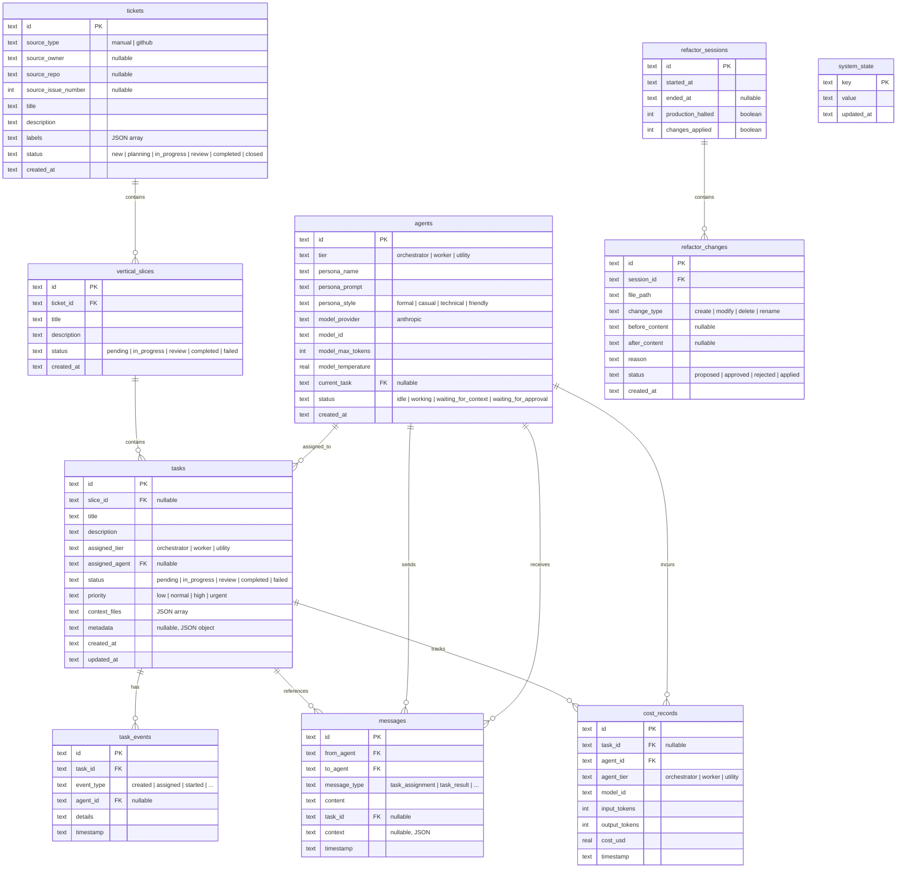

# Database Schema

This document describes the complete database schema for nexor.

## Entity Relationship Diagram



## Table Details

### Core Workflow Tables

#### `tickets`

Represents work items from GitHub issues or manual entry.

| Column | Type | Constraints | Description |
|--------|------|-------------|-------------|
| `id` | TEXT | PRIMARY KEY, NOT NULL | UUID identifier |
| `source_type` | TEXT | NOT NULL, DEFAULT 'manual' | `manual` or `github` |
| `source_owner` | TEXT | nullable | GitHub repository owner |
| `source_repo` | TEXT | nullable | GitHub repository name |
| `source_issue_number` | INTEGER | nullable | GitHub issue number |
| `title` | TEXT | NOT NULL | Ticket title |
| `description` | TEXT | NOT NULL, DEFAULT '' | Detailed description |
| `labels` | TEXT | NOT NULL, DEFAULT '[]' | JSON array of label strings |
| `status` | TEXT | NOT NULL, DEFAULT 'new' | Workflow status |
| `created_at` | TEXT | NOT NULL, DEFAULT datetime('now') | Creation timestamp |

**Status Values:** `new`, `planning`, `in_progress`, `review`, `completed`, `closed`

**Indexes:**
- `idx_tickets_status` on `status`

---

#### `vertical_slices`

Decomposes tickets into smaller, independently deliverable slices.

| Column | Type | Constraints | Description |
|--------|------|-------------|-------------|
| `id` | TEXT | PRIMARY KEY, NOT NULL | UUID identifier |
| `ticket_id` | TEXT | FOREIGN KEY → tickets(id), NOT NULL | Parent ticket |
| `title` | TEXT | NOT NULL | Slice title |
| `description` | TEXT | NOT NULL, DEFAULT '' | Slice details |
| `status` | TEXT | NOT NULL, DEFAULT 'pending' | Workflow status |
| `created_at` | TEXT | NOT NULL, DEFAULT datetime('now') | Creation timestamp |

**Status Values:** `pending`, `in_progress`, `review`, `completed`, `failed`

**Indexes:**
- `idx_slices_ticket` on `ticket_id`
- `idx_slices_status` on `status`

---

#### `tasks`

Atomic work units assigned to agents.

| Column | Type | Constraints | Description |
|--------|------|-------------|-------------|
| `id` | TEXT | PRIMARY KEY, NOT NULL | UUID identifier |
| `slice_id` | TEXT | FOREIGN KEY → vertical_slices(id), nullable | Parent slice |
| `title` | TEXT | NOT NULL | Task title |
| `description` | TEXT | NOT NULL, DEFAULT '' | Task details |
| `assigned_tier` | TEXT | NOT NULL, DEFAULT 'worker' | Target agent tier |
| `assigned_agent` | TEXT | FOREIGN KEY → agents(id), nullable | Assigned agent |
| `status` | TEXT | NOT NULL, DEFAULT 'pending' | Task status |
| `priority` | TEXT | NOT NULL, DEFAULT 'normal' | Priority level |
| `context_files` | TEXT | NOT NULL, DEFAULT '[]' | JSON array of file paths |
| `metadata` | TEXT | nullable | JSON object for routing hints |
| `created_at` | TEXT | NOT NULL, DEFAULT datetime('now') | Creation timestamp |
| `updated_at` | TEXT | NOT NULL, DEFAULT datetime('now') | Last update timestamp |

**Status Values:** `pending`, `in_progress`, `review`, `completed`, `failed`

**Priority Values:** `low`, `normal`, `high`, `urgent`

**Tier Values:** `orchestrator`, `worker`, `utility`

**Indexes:**
- `idx_tasks_status` on `status`
- `idx_tasks_slice_id` on `slice_id`
- `idx_tasks_assigned_agent` on `assigned_agent`

---

#### `task_events`

Append-only audit log of all task state changes.

| Column | Type | Constraints | Description |
|--------|------|-------------|-------------|
| `id` | TEXT | PRIMARY KEY, NOT NULL | UUID identifier |
| `task_id` | TEXT | FOREIGN KEY → tasks(id), NOT NULL | Related task |
| `event_type` | TEXT | NOT NULL | Event type enum |
| `agent_id` | TEXT | FOREIGN KEY → agents(id), nullable | Acting agent |
| `details` | TEXT | NOT NULL, DEFAULT '' | Event details |
| `timestamp` | TEXT | NOT NULL, DEFAULT datetime('now') | Event timestamp |

**Event Types:**
- `created` - Task was created
- `assigned` - Task assigned to an agent
- `started` - Agent started working
- `progress_update` - Progress checkpoint
- `context_requested` - Agent needs more context
- `submitted_for_review` - Ready for review
- `review_feedback` - Review comments received
- `completed` - Task finished successfully
- `failed` - Task failed
- `cancelled` - Task was cancelled
- `escalated` - Task escalated to higher tier

**Indexes:**
- `idx_task_events_task_id` on `task_id`
- `idx_task_events_timestamp` on `timestamp`

---

### Agent Tables

#### `agents`

AI agent instances with model configuration.

| Column | Type | Constraints | Description |
|--------|------|-------------|-------------|
| `id` | TEXT | PRIMARY KEY, NOT NULL | UUID identifier |
| `tier` | TEXT | NOT NULL | Agent tier |
| `persona_name` | TEXT | NOT NULL | Display name |
| `persona_prompt` | TEXT | NOT NULL, DEFAULT '' | System prompt |
| `persona_style` | TEXT | NOT NULL, DEFAULT 'casual' | Communication style |
| `model_provider` | TEXT | NOT NULL, DEFAULT 'anthropic' | LLM provider |
| `model_id` | TEXT | NOT NULL | Model identifier |
| `model_max_tokens` | INTEGER | NOT NULL, DEFAULT 4096 | Max output tokens |
| `model_temperature` | REAL | NOT NULL, DEFAULT 0.7 | Temperature setting |
| `current_task` | TEXT | FOREIGN KEY → tasks(id), nullable | Active task |
| `status` | TEXT | NOT NULL, DEFAULT 'idle' | Agent status |
| `created_at` | TEXT | NOT NULL, DEFAULT datetime('now') | Creation timestamp |

**Tier Values:** `orchestrator`, `worker`, `utility`

**Style Values:** `formal`, `casual`, `technical`, `friendly`

**Status Values:** `idle`, `working`, `waiting_for_context`, `waiting_for_approval`

**Indexes:**
- `idx_agents_tier` on `tier`
- `idx_agents_status` on `status`

---

#### `messages`

Inter-agent communication log.

| Column | Type | Constraints | Description |
|--------|------|-------------|-------------|
| `id` | TEXT | PRIMARY KEY, NOT NULL | UUID identifier |
| `from_agent` | TEXT | FOREIGN KEY → agents(id), NOT NULL | Sender agent |
| `to_agent` | TEXT | FOREIGN KEY → agents(id), NOT NULL | Recipient agent |
| `message_type` | TEXT | NOT NULL | Message type enum |
| `content` | TEXT | NOT NULL | Message body |
| `task_id` | TEXT | FOREIGN KEY → tasks(id), nullable | Related task |
| `context` | TEXT | nullable | JSON TaskContext |
| `timestamp` | TEXT | NOT NULL, DEFAULT datetime('now') | Message timestamp |

**Message Types:**
- `task_assignment` - Assign task to agent
- `task_result` - Report task completion
- `review_request` - Request review
- `review_feedback` - Provide review feedback
- `context_request` - Request additional context
- `context_response` - Provide requested context
- `escalation` - Escalate to higher tier
- `status_update` - Status notification

**Indexes:**
- `idx_messages_from` on `from_agent`
- `idx_messages_to` on `to_agent`
- `idx_messages_task` on `task_id`
- `idx_messages_timestamp` on `timestamp`

---

### Cost Tracking

#### `cost_records`

LLM API usage and cost tracking.

| Column | Type | Constraints | Description |
|--------|------|-------------|-------------|
| `id` | TEXT | PRIMARY KEY, NOT NULL | UUID identifier |
| `task_id` | TEXT | FOREIGN KEY → tasks(id), nullable | Related task |
| `agent_id` | TEXT | FOREIGN KEY → agents(id), NOT NULL | Agent making call |
| `agent_tier` | TEXT | NOT NULL | Agent tier at time of call |
| `model_id` | TEXT | NOT NULL | Model used |
| `input_tokens` | INTEGER | NOT NULL | Input token count |
| `output_tokens` | INTEGER | NOT NULL | Output token count |
| `cost_usd` | REAL | NOT NULL | Cost in USD |
| `timestamp` | TEXT | NOT NULL, DEFAULT datetime('now') | Call timestamp |

**Indexes:**
- `idx_cost_records_task` on `task_id`
- `idx_cost_records_agent` on `agent_id`
- `idx_cost_records_tier` on `agent_tier`
- `idx_cost_records_timestamp` on `timestamp`

---

### System Management

#### `system_state`

Key-value store for system configuration.

| Column | Type | Constraints | Description |
|--------|------|-------------|-------------|
| `key` | TEXT | PRIMARY KEY, NOT NULL | Configuration key |
| `value` | TEXT | NOT NULL | Configuration value |
| `updated_at` | TEXT | NOT NULL, DEFAULT datetime('now') | Last update |

**Predefined Keys:**
- `production_mode` - System running state (`running`, `paused`, etc.)

---

#### `refactor_sessions`

Tracks refactor mode sessions.

| Column | Type | Constraints | Description |
|--------|------|-------------|-------------|
| `id` | TEXT | PRIMARY KEY, NOT NULL | UUID identifier |
| `started_at` | TEXT | NOT NULL | Session start time |
| `ended_at` | TEXT | nullable | Session end time (null if active) |
| `production_halted` | INTEGER | NOT NULL, DEFAULT 0 | Boolean: production paused |
| `changes_applied` | INTEGER | NOT NULL, DEFAULT 0 | Boolean: changes committed |

**Indexes:**
- `idx_refactor_sessions_active` on `ended_at` WHERE `ended_at IS NULL`

---

#### `refactor_changes`

Proposed code changes during refactor sessions.

| Column | Type | Constraints | Description |
|--------|------|-------------|-------------|
| `id` | TEXT | PRIMARY KEY, NOT NULL | UUID identifier |
| `session_id` | TEXT | FOREIGN KEY → refactor_sessions(id), NOT NULL | Parent session |
| `file_path` | TEXT | NOT NULL | Target file path |
| `change_type` | TEXT | NOT NULL | Type of change |
| `before_content` | TEXT | nullable | Original content |
| `after_content` | TEXT | nullable | New content |
| `reason` | TEXT | NOT NULL, DEFAULT '' | Change justification |
| `status` | TEXT | NOT NULL, DEFAULT 'proposed' | Change status |
| `created_at` | TEXT | NOT NULL, DEFAULT datetime('now') | Creation timestamp |

**Change Types:** `create`, `modify`, `delete`, `rename`

**Status Values:** `proposed`, `approved`, `rejected`, `applied`

**Indexes:**
- `idx_refactor_changes_session` on `session_id`
- `idx_refactor_changes_status` on `status`

---

## Relationship Summary

```
tickets (1) ─────────────────────────┐
    │                                │
    │ contains                       │
    ▼                                │
vertical_slices (many)               │
    │                                │
    │ contains                       │
    ▼                                │
tasks (many) ◄───────────────────────┘
    │           │
    │ has       │ references
    ▼           ▼
task_events   messages ◄──── agents
                  │             │
                  │             │ incurs
                  │             ▼
                  └────────► cost_records


refactor_sessions (1)
    │
    │ contains
    ▼
refactor_changes (many)


system_state (standalone key-value)
```

## Data Type Conventions

| Concept | SQLite Type | Format |
|---------|-------------|--------|
| UUIDs | TEXT | Hyphenated string (e.g., `550e8400-e29b-41d4-a716-446655440000`) |
| Enums | TEXT | Lowercase snake_case (e.g., `in_progress`) |
| Timestamps | TEXT | RFC3339 format (e.g., `2024-01-15T10:30:00Z`) |
| JSON Arrays | TEXT | Serialized JSON (e.g., `["file1.rs", "file2.rs"]`) |
| JSON Objects | TEXT | Serialized JSON (e.g., `{"key": "value"}`) |
| Booleans | INTEGER | 0 = false, 1 = true |

## Migration History

| Migration | Description |
|-----------|-------------|
| 001 | Core tasks table |
| 002 | Task events audit log |
| 003 | Agents table with model config |
| 004 | Messages for agent communication |
| 005 | Cost tracking records |
| 006 | Tickets and vertical slices hierarchy |
| 007 | System state, refactor sessions/changes |
| 008 | Task metadata column for routing |
